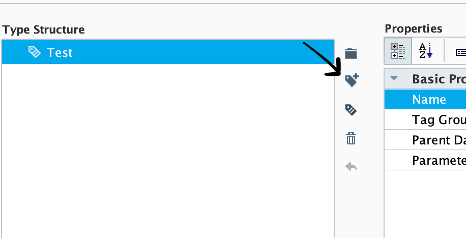
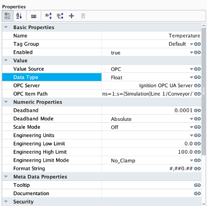
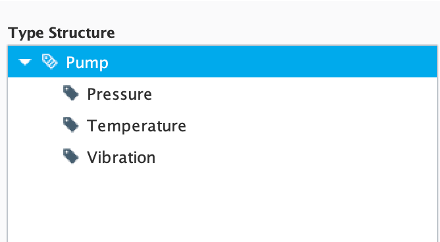
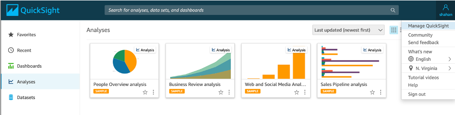
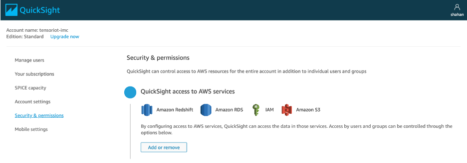
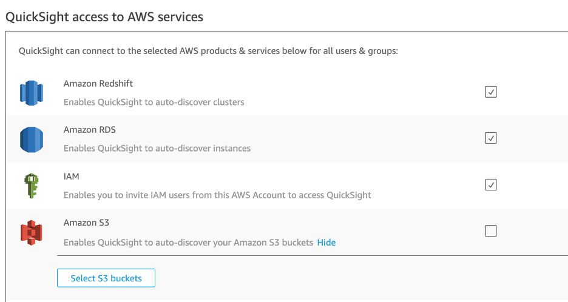
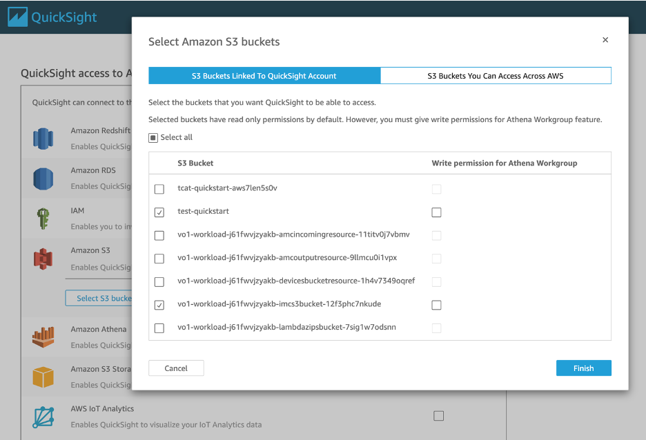
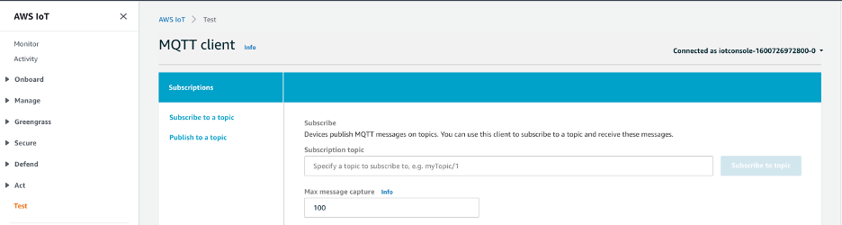
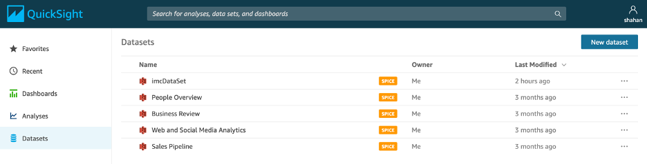

### Artifacts

The following directories and files are necessary for running an IMC Quick Start deployment: 

    functions/
    scripts/
    templates/
    LICENSE.txt
    NOTICE.txt
    README.md

* **quickstart-IMC/**: The root directory in the S3 bucket, where the rest of the folders live.
* **functions/**: Contains zipped lambda code that is used for various pieces of the IMC Quick Start.
* **scripts/**: Contains the scripts that are run on physical hardware if running a physical deployment.
* **templates/**: Contains the various CloudFormation templates that will be deployed depending on the deployment options selected during stack creation.

### AMC-Approved DynamoDB Format

**Asset Model Table Name:**

`[name-of-stack]-asset-model-table`

**Example of asset model entry:**

```
assetModelEntry = {
    “assetModelName”: type<string>, # Name of the asset model
    “parent”: type<string>, # name of the parent asset model, if any
    “assetModelProperties”: type<list<modelProperty>>, # list of sitewise assetModelProperties as ‘modelProperty’ listed below.
    “assetModelHierarchies”: type<list>, # sitewise assetModelHierarchies, leave blank []
    “change”: type<string>, # Should be ‘YES’, indicates in DynamoDB that the record is new or updated.
}
    modelProperty = {
        ‘name’: type<string>, # Name of the property
        ‘dataType’: type<string>, # Sitewise data type of the property
        ‘type’: {
            ‘measurement’: {} # Don’t change this or populate it with anything, used to identify property type in sitewise
        }
    }
```

**Asset Table Name:**

`[name-of-stack]-asset-table`

**Example of asset entry:**

```
assetEntry = {
    ‘assetName’: type<string>, # name of the asset
    ‘modelName’: type<string>, # model name this asset is an instance of
    ‘change’: type<string>, # Should be ‘YES’, indicates in DynamoDB that the record is new or updated.
    ‘tags’: type<list<tagEntry>>, # List of tagEntry struct, as specified below
}    tagEntry = {
        ‘tagName’: type<string>, # name of the tag
        ‘tagPath’: type<string>, # Full property alias path for the tag
    }
```


### Add a line and device to an Ignition project

1. Navigate to the Ignition Designer and connect to your Ignition server.
    1. Launch the Designer
    2. Click “Add Designer” 
    3. Click “Manually Add Gateway”
    4. Add a Gateway URL in the following format: `http://[ignition_ec2_public_ip]:8088`
    5. Under the Gateway tile you just added, click “Launch” 
    6. Supply the username and password and click “Login”
        * Username: admin
        * Password: password
        * If you haven’t already, it is recommended that you change your password once you’ve successfully logged into the Ignition web UI.
2. Create a Data Type
    1. Nagivate to the Tag Browser, expand “Tags”, right click “Data Types” -> New Tag -> New Data Type
    2. Under Properties, name the Data Type “Pump”, and click “Apply”
3. Configure the Tags for the Data Type
    1. Tag 1: Temperature
        1. To the left of the “Properties” section, click the “Add Tag” button, and select OPC Tag: 

            

            Next, edit the “Basic Properties” of the tag:

        2. Name the tag “Temperature”
        3. Change its Data Type to float 
        4. Click the Link icon to the right of “OPC Server”, click “Browse OPC”, right click on Ignition OPC UA Server, and click “Copy Item Path”, then “Commit”. Right click in the space to the right of OPC Server and paste what’s copied in your clipboard.
        5. Click the Link icon to the right of OPC Item Path, click “Browse OPC”, expand Ignition OPC UA Server, expand Devices, expand, [Simulation], Line 1, Conveyor. Highlight “Temperature” and press “Commit”. 
        6. Ensure your tag configuration looks similar to the UI screenshot below:
        7. Click “Apply” and “OK” to accept the tag configuration.

            
    2. Tag 2: Pressure
        
        Create a second tag to represent "Pressure".
        
        1. To the left of the “Properties” section, click the “Add Tag” button, and select OPC Tag: 
        2. Edit the “Basic Properties” 
            1. Name the tag “Pressure”
            2. Change its Data Type to float 
            3. Click the Link icon to the right of “OPC Server”, click “Browse OPC”, right click on Ignition OPC UA Server, and click “Copy Item Path”, then “Commit”. Right click in the space to the right of OPC Server and paste what’s copied in your clipboard.
            4. Click the Link icon to the right of OPC Item Path, click “Browse OPC”, expand Ignition OPC UA Server, expand Devices, expand, [Simulation], expand Line 1, expand Stamping Machine. Highlight “Pressure” and press “Commit”. 
            5. Click “Apply” and “OK” to accept the tag configuration.

    3. Tag 3: Vibration
    
        Create a third tag to represent "Vibration"

        1. To the left of the “Properties” section, click the “Add Tag” button, and select OPC Tag: 
        2. Edit the “Basic Properties” 
            1. Name the tag “Vibration”
            2. Change its Data Type to float 
            3. Click the Link icon to the right of “OPC Server”, click “Browse OPC”, right click on Ignition OPC UA Server, and click “Copy Item Path”, then “Commit”. Right click in the space to the right of OPC Server and paste what’s copied in your clipboard.
            4. Click the Link icon to the right of OPC Item Path, click “Browse OPC”, expand Ignition OPC UA Server, expand Devices, expand, [Simulation], expand Line 1, expand Conveyor. Highlight “Vibration” and press “Commit”. 
            5. Click “Apply” and “OK” to accept the tag configuration.
            6. Click “Apply” and “OK” to accept the Pump configuration.
            7. By the time you’re finished adding all your tags, the Pump should look like this:

            

4. Add the line to the project:

    1. Under the Tag Browser, expand All Providers, right click on “default” -> New Tag -> New Folder -> Line 4 -> OK. 
    2. Right click “Line 4” -> New Tag -> New Data Type Instance -> Pump
        * Give the instance the name “Pump”, press “Apply” and “OK”.
    3. Trigger a birth message:
        * Under the Tag Browser, expand Tag Providers, expand default, expand Sim Controls. To the right of “New Birth”, check the checkbox and “Write Once”. 

*This triggers an MQTT message that defines your new hierarchy, with Line 4 and the Pump included. You should see your new models and assets in SiteWise.*

### Setting up a QuickSight dashboard along with the IMC Quick Start deployment

After the IMC Quick Start deployment succeeds (models and assets have finished creation in AWS IoT SiteWise), the following manual steps are required to create a QuickSight dataset. 

Allow QuickSight access to the S3 bucket that houses the data from the IMC Quick Start. Navigate to the Manage QuickSight from the top right corner navbar.



Navigate to “Security & permissions”, then click “Add or remove” under “QuickSight access to AWS services.



Click on the checkbox to the right of “Amazon S3” under “QuickSight access to AWS services”.



Find the S3 bucket labeled `[IMCQSDeploymentName]...-imcs3bucket-….`, click the checkbox on the left side, and click “Finish”.



Navigate to the IoT Console, click “Test” on the navbar on the left-hand side of the screen to arrive at the MQTT client.



Trigger the creation of your QuickSight dataset by publishing an MQTT message to the MQTT topic: `imc/control/quicksight`. The content of the message is inconsequential.


After the message is published, a Dataset called “imcDataSet” will populate in the QuickSight Dataset dashboard. Click into the Dataset to create a visualization analysis.



Now that there is a dataset created in QuickSight, you are able to create visualizations with the data. Refer to the [QuickSight documentation](https://docs.aws.amazon.com/quicksight/latest/user/welcome.html) for more details.

### Launching CloudFormation stack from your own S3 bucket

This section details how developers who wish to extend/modify the IMC Quick Start with new features/capabilities. They should clone the public [Quick Start repo](https://github.com/aws-quickstart/quickstart-aws-industrial-machine-connectivity), create a new S3 bucket and add the repo assets to that bucket. The following instructions detail the process:

1. Create a new S3 bucket and give it a unique name such as “imc-dev-123”
2. In that S3 bucket, create a folder called “quickstart-IMC”
3. Download the public IMC [Quick Start Github repo](https://github.com/aws-quickstart/quickstart-aws-industrial-machine-connectivity) as a zip file.
4. Unzip the downloaded file and copy all the contents of the unzipped folder (Github repo contents) into the “quickstart-IMC” folder in your S3 bucket. The structure will then resemble the structure below:
    * S3 bucket name: `imc-dev-123`
    * S3 bucket content:

        ```
        quickstart-IMC/
                documentation/
        functions/
                scripts/
            submodules/
                templates/
                .gitignore
            .gitmodules
            .taskcat.yml
        LICENSE.txt
                NOTICE.txt
                README.md
        ```
