## Element Unify

>This document describes post-deployment steps to model source system metadata into asset models that are deployable to AWS IoT SiteWise. As a result of the steps below, you will be able to:

- Ingest tag configurations from edge devices such as Ignition and KepServerEx into Element Unify.
- Integrate SAP and P&ID data exports with the context from Ignition and KepServerEx.
- Automatically egress the standardized Element Unify data model to AWS IoT SiteWise as asset models and assets.
- Automatically push Element Unify model updates to AWS IoT SiteWise resulting in rearranged or updated AWS IoT SiteWise data models.
- Import existing AWS IoT SiteWise models.

### Ingest tag definition files from edge devices

1. Export the JSON file that describes your project hierarchy from Ignition or KepServerEX
2. Rename the JSON file based on the following convention

`[siteName]-[serverName]-*.json`

where,

- `siteName` is the name of the site
- `serverName` is the name of the server, either `Ignition` or `KepServerEX`
- `*` is free-form text

For the virtual deployment, use the file names below:

|Export|File name|
|------|---------|
|First Ignition export|Baytown-Primary-IgnitionConfig.json|
|Second Ignition export|Houston-Secondary-IgnitionConfig.json|
|KepServerEx export|Houston-Server001-KepServerExConfig.json|

3. Upload the JSON file into the appropriate `Ignition` or `KepServerEX` directory in the folowing S3 bucket

`[name of stack]-unifyincomingresource-[hash]`

The exported tag definition file (factory, lines, machines, and tags) will automatically be imported into Element Unify. If the import is successful the tag definition file will be deleted from the S3 bucket.

## View the imported files in Element Unify
### Dataset Catalog
The imported tag definitions can be viewed in the Dataset Catalog, as shown below.

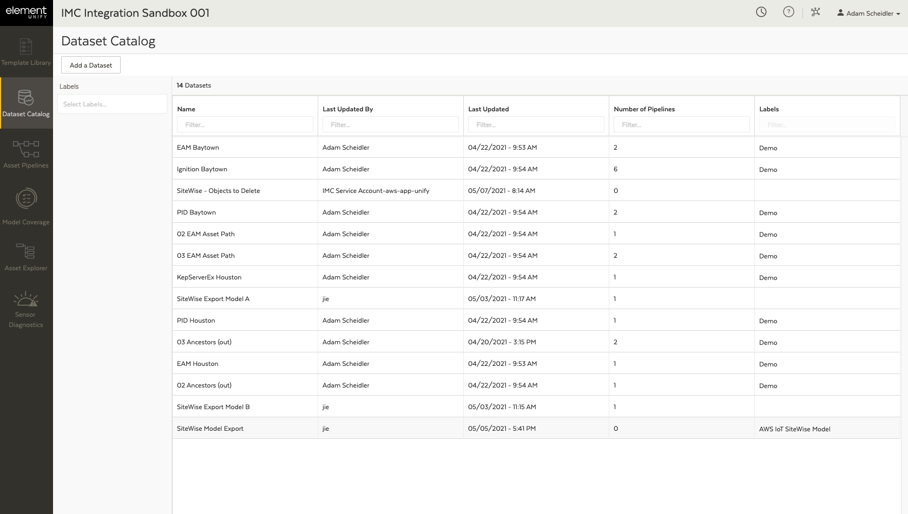

The Dataset Catalog provides functionalities to view, organize, and manage datasets. It also enables a user to quickly view relevant information, such as:

- **Details**. Contains information related to the source and usage of a dataset.
- **Preview**. Contains a preview of the data and schema, along with summary statistics, such as the number of columns and rows.
- **History**. Contains the event history of a dataset that enables a complete audit review of any past actions.
- **Access**. Contains the configuration details for an ODBC or JDBC connection.

#### Ignition tag definition dataset
The Ignition tag definition dataset follows the below naming convention and schema.

`Ignition-[datetime stamp]-[sitename]-[servername]`

|Column Name|Description|
|-----------|-----------|
|Site Name| The name of the site as defined in the filename|
|Server Name| Name of the server as defined in the filename|
|Name|The static value or sensor mapping|
|Asset Model|The name of the asset model, if defined in Ignition|
|Asset Name|The name of the asset, if defined in Ignition|
|Asset Path|The hierarchy path to the asset (excludes the asset itself), if defined in Ignition|
|Property Name|The name of the measurement or attribute property, if defined in Ignition|
|Unit of Measure|The engineering units for the measurement or attribute property|
|Data Type|The type of data for the measurement or attribute property|
|Source|The type of source (e.g., OPC, derived, query, etc.)|
|OPC Item Path|The path if the source is OPC|

The dataset will have the following labels, for easier searching and filtering in the Dataset Catalog:

`imc`, `ignition`, `[sitename]`, `[servername]`

#### KepServerEX tag definition dataset

The KepServerEX tag definition dataset follows the below naming convention and schema.

`KepServerEX-[datetime stamp]-[sitename]-[servername]`

|Column Name|Description|
|-----------|-----------|
|Site Name| The name of the site as defined in the filename|
|Server Name| Name of the server as defined in the filename|
|Name|The static value or sensor mapping|
|Description|A free-form text field that helps to identify the project in report and monitoring systems|
|Project|The project the sensor belongs to in the server|
|Channel|The communication medium from the originating PC to one or more external devices|
|Device|The PLC, controller, or other hardware with which the server communicates|
|Unit of Measure|The engineering units for the measurement or attribute property|
|Data Type|The type of data for the measurement or attribute property|

The dataset will have the following labels, for easier searching and filtering in the Dataset Catalog:

`imc`, `kepserverex`, `[sitename]`, `[servername]`

### Template Library

If a tag definition file contains an asset model, the imported asset model (defined as an asset template) can be viewed in the Template Library, as shown below.

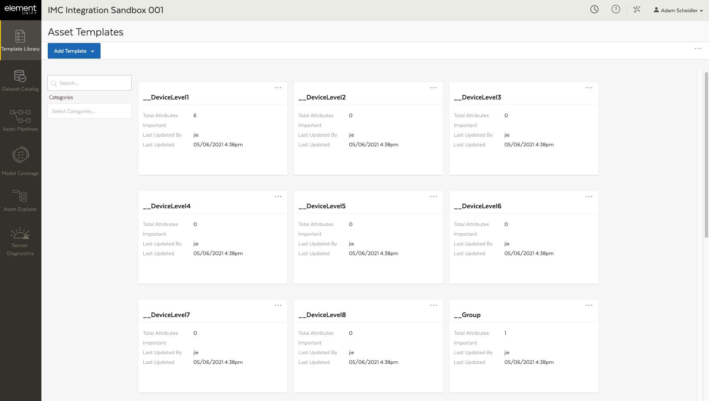

The Template Library provides functionalities to view, organize, and manage all asset templates. It also enables a user to quickly manage templates at scale.

#### Attribute types
By default, attributes are configured as *measurements* in Element Unify. These use *aliases* in AWS IoT SiteWise to point to sensor names. To configure a *static* attribute, the attribute's configuration parameters should be updated to include the below key:value pairs.

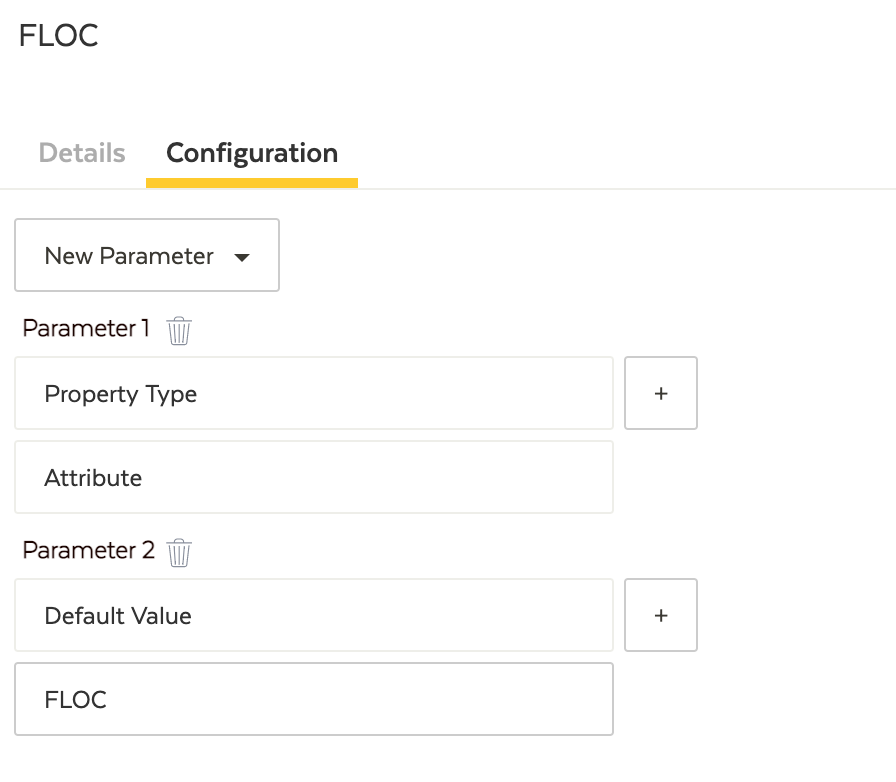

The `Property Type` parameter with a value of `Attribute` is used specify the attribute as static and the `Default Value` parameter can be used to set a default value.

For instance, to store predictive results from AWS Lookout, use the following `attribute configuration:

|Area|Item|Value|
|----|----|-----|
|Attribute|Data Type|Boolean|
|Configuration Parameter|Property Type|Attribute|
|Configuration Parameter|Default Value|false|

Note that possibile values for `Property Type` include `Measurement`, `Attribute`, `Metric`, and `Transform`. 

#### Ignition tag definition asset model

If the Ignition tag definition file contains an asset model, corresponding asset templates will be created in Element Unify. The templates adhere to the below naming convention.

`<asset name>-sitename-servername`

## Data modeling
### Mapping process
Part of the data modeling process requires the mapping of tag definitions to templates and attributes. Mapping enables the synchronization of pipelines, datasets, and asset templates. The mapping process is performed by implementing purpose-built data transformations.

- **Map Asset ID.** Is used to specify the metadata values associated with the Equipment ID and then use it to construct a unique Asset ID.
- **Map Templates.** Is used to assign an asset template to a source metadata value that identifies the name of an asset or equipment.
- **Map Attributes.** Is used to associate attribute metadata from source systems with the appropriate asset template attributes, identifying the attribute type or the sensor type.

These transformations are used in sequence near the end of a pipeline as shown below.

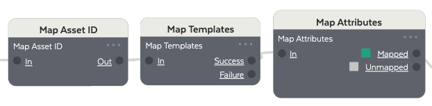

> Each Asset ID must be unique, if there are duplicate assets that are unique based on hierarchy path, the *Concatenate Columns* transformation can be used to join the *Asset Path* and the *Asset Name* columns to create a unique Asset ID

### Assign mappings to each level of the hierarchy
To create a hierarchy in AWS IoT SiteWise, each level in the hierarchy must be assigned to a template in Element Unify. The hierarchy can come from the edge application or developed through the integration of metadata from IT/OT sources in Element Unify. To facilitate the building of hierarchies, a demo *Ancestor Path Function* has been created to extract each level in a hierarchy (referred to as ancestor paths). Functions in Element Unify are packaged transformations that can be reused in other pipelines.


1. Insert a *new in* transformation into the pipeline. The *new in* transformation is used to designate an input data flow to the function.
2. Connect a *SQL Query* transformation. The *SQL Query* transformation is used to extract the ancestor paths from the `Asset Path` column, excluding the asset itself. The logic is based on the below query:

```sql
SELECT DISTINCT
  `Asset Name`, 
  rtrim('\\', substring_index(`Asset Path`, `Asset Name`, 1)) as `Asset Path`
FROM
(
  SELECT
    distinct `Asset Path`,
    explode(split(`Asset Path`, '\\\\')) as `Asset Name`
  FROM In
  GROUP BY `Asset Path`
)
WHERE `Asset Name` <> ""
```

> The SQL Query assumes that each level in the hierarchy is delimited by a forward slash (/)

3. Connect a *SQL Query* transformation. The *SQL Query* transformation is used to create the output schema and replace any forward slashes (/) with blackslahes (\\). The logic is based on the below query:

```sql
SELECT DISTINCT
  "" AS `Mapping`,
  "" AS `Property Name`,
  `Asset Name`,
  CASE 
    WHEN `Asset Path` = '' THEN '\\' 
    ELSE REGEXP_REPLACE(`Asset Path`, '(/)','\\\\') 
  END AS `Asset Path`
FROM in
```

4. Connect a *new out* transformation. The *new out* transformation is used to designate an output data flow from the function.

### Single and multiple site deployments
To designate the datastream source for both single and multiple site deployments, a `data stream prefix` must be configured in Element Unify and AWS IoT SiteWise. The `data stream prefix` prefix should follow the below convention.

`[site name]-[gateway designation]`

where,

- `site name` is the name of the site
- `gateway designation` is the designation of the gateway, either `Primary` or `Secondary`

In Element Unify, the `data stream prefix` is designated by prepending the prefix to the alias mapping. This is performed by using a combination of the `REGEXP_REPLACE` and `CONCAT` methods in a *SQL Query* transformation, as shown below.

```sql
REGEXP_REPLACE(CONCAT('[data_stream_prefix]', `Name`), '(\\\\)', '/') AS `Mapping`
```

In AWS IoT SiteWise, the `data stream prefix` is designated by updating the *Data stream prefix* option on the OPC-UA server gateway in the AWS console as shown below.

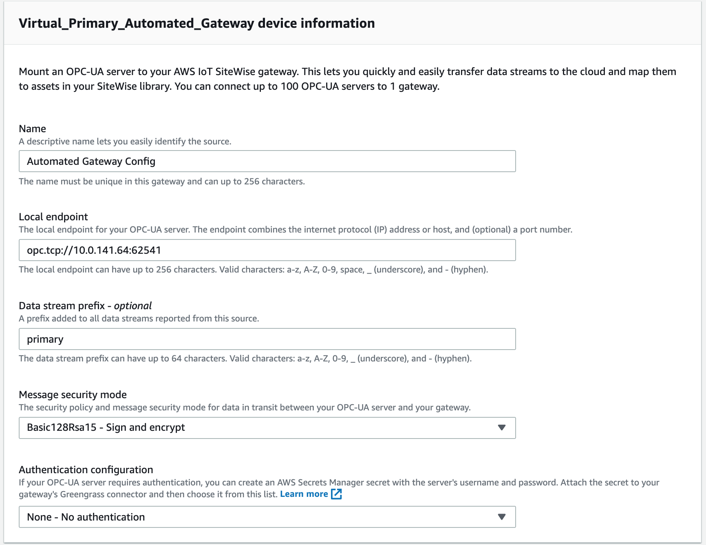

> It is important that the `data stream prefix` is the same for both Element Unify and AWS IoT SiteWise

## Exporting to AWS IoT SiteWise
### Data model requirements
To export a data model to AWS IoT SiteWise, it must be configured as a dataset in the Dataset Catalog and contain an `AWS IoT SiteWise Model` label, as shown below.

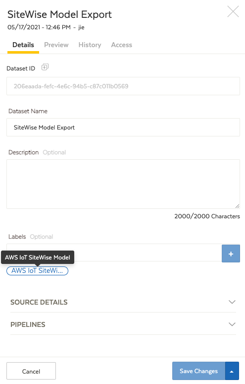

> Only one dataset at a time should have the `AWS IoT SiteWise Model` label assigned

A *derived dataset* can be used to connect the output data flow in a pipeline to a dataset. The schema of the dataset must match the below convention.

|Column|Description|
|------|-----------|
|Mapping|The alias or static value to map onto the attribute or property|
|Asset Property|The name of the attribute or property|
|Asset Name|The name of the asset|
|Asset Path|The hierarchy path of the asset|
|Asset Model|The template of the asset|

>The `Mapping` column should only use forward slashes (/) as delimiter and the `Asset Path` should only use backward slashes (\\) as a delimiter.

### Triggering the export process
The *UnifySiteWiseUpdater* Lambda function is used to export the data model in Element Unify to AWS IoT SiteWise. The data model is mapped onto AWS IoT SiteWise asset models and hierarchies. The Lambda function has the below convention:

`[stack name]-UnifySiteWiseUpdater-[stack id]`

where,

- `stack name` is the name of the stack
- `UnifySiteWiseUpdater` is the name of the Lambda function
- `stack id` is the generated stack id from initial deployment

The function is invoked manually by triggering a test event from the AWS Lambda console. The default `hello-world` test event can be used.

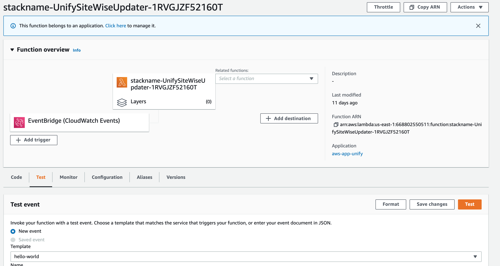

### Deploying to and updating AWS IoT Sitewise
The *UnifySiteWiseUpdater* Lambda function is used to automatically propagate changes in the data model between Element Unify and AWS IoT SiteWise. By default, the function is schedule to run every hour. The interval can be changed be editing the `UnifySiteWiseUpdaterScheduledRule` rule in the AWS EventBridge console.

The EventBridge event for the *UnifySiteWiseUpdater* Lambda function is shown below.

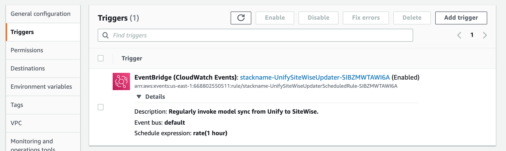

The `UnifySiteWiseUpdaterScheduledRule` rule for the EventBridge event is shown below.

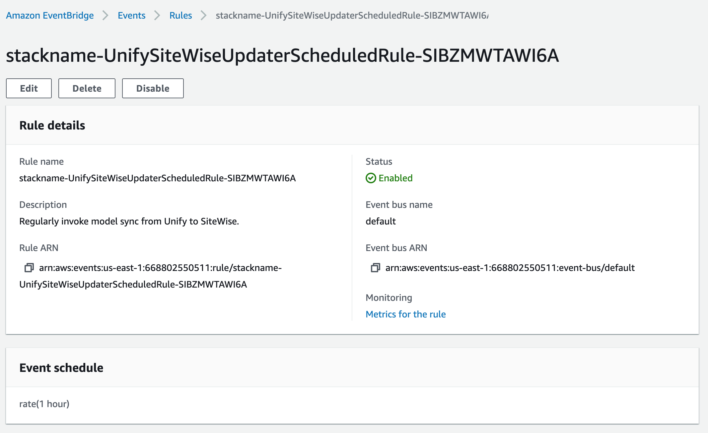

To change the scheduled interval, edit the rate for the event pattern.

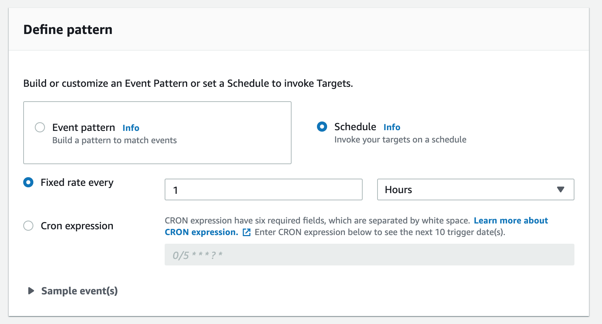

## Exercise 1 - Single site basic deployment
A single site basic deployment involves importing the tag definition file from the edge application into Element Unify with minimal configuration before exporting the data model to AWS IoT SiteWise. This deployment consists of:

1. Transforming the imported data model
2. Mapping the data model
2. Creating a hierarchy
3. Exporting the data model to AWS IoT SiteWise

The **01. Single Site - Basic** demo pipeline can be used as a starting point and customized to suit specific project requirements.

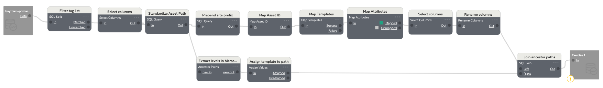

> The single site basic deployment assumes that the AWS Partner or customer is using Ignition as the third party edge application and that an asset model has been defined

### Exercise 1.1 - Transforming the imported data model
Data transformations are used to initially clean and standardize the imported tag definition dataset, as shown below.


1. Insert the *Ignition Baytown* tag definition dataset into the pipeline.
2. Connect a *SQL Split* transformation. The *SQL Split* transformation is used to filter the tag definition dataset to exclude tags not associated with the data model.
3. Connect a *Select Columns* transformation. The *Select Columns* transformation is used to select the `Asset Model`, `Asset Name`, `Asset Path`, `Name`, and `Property Name` columns.
4. Connect a *SQL Query* transformations. The *SQL Query* transformation is used to standardize the `Name` and `Asset Path` value. The logic is based on the below query.

```sql
SELECT
  REGEXP_REPLACE(`Name`, '(\\\\)', '/') AS `Name`,
  `Asset Model`,
  `Asset Name`,
  `Property Name`,
  REGEXP_REPLACE(`Asset Path`, '(/)','\\\\') AS `Asset Path`
FROM in
```

5. Connect a *SQL Query* transformation. The *SQL Query* transformation is used to prepend the `data stream prefix` to the alias mapping. The logic is based on the below query.

```sql
SELECT
  `Asset Model`,
  `Asset Name`,
  `Asset Path`,
  `Property Name`,
  CONCAT('Baytown-Primary', `Name`) AS `Mapping`
FROM in
```

### Exercise 1.2 - Mapping the data model
The data model is mapped to specific templates and attributes using the purpose built mapping transformations, as shown below.

> Refer to [Mapping Process](#mapping-process) for more information.

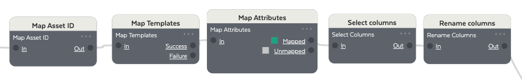

1. Connect a *Map Asset ID* transformation. The *Map Asset ID* transformation is used to create a unique ID for each asset based on the `Asset Name` column.
2. Connect a *Map Templates* transformation. The *Map Templates* transformation is used to map the asset model to a specific template based on the `Asset Model` column.
3. Connect a *Map Attributes* transformation. The *Map Attributes* transformation is used to map the sensor aliases to specific attributes on a template based on the `Property Name` column.
4. Connect a *Select Columns* transformation. The *Select Columns* transformation is used to select the `Asset Path`, `EQUIPMENT_ID *`, `Mapping`, `SENSOR *`, and `TEMPLATE *` columns.
5. Connect a *Rename Columns* transformation. The *Rename Columns* transformation is used to rename the columns in accordance with the below table.

|Current Column Name|New Column Name|
|-------------------|---------------|
|TEMPLATE *|Asset Model|
|EQUIPMENT_ID *|Asset Name|
|SENSOR *|Property Name|

### Exercise 1.3 - Creating a hierarchy
A hierarchy for the data model is created from the tag definition dataset by using the *Ancestor Path* function, as shown below.

> Refer to [Assign mappings to each level of the hierarchy](#Assign-mappings-to-each-level-of-the-hierarchy) for more information.

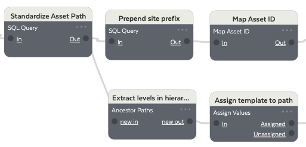

1. Insert the *Ancestor Path* function. The *Ancestor Path* function is used to extract each level in the hierarchy and should be connected to the transformation with the label *Standardize Asset Path*.
2. Connect an *Assign Values* transformation. The *Assign Values* transformation is used to assign each level in the hierarchy to a template. The assignments are based on the table below.

|Hierarchy Level|Asset Model|
|---------------|-----------|
|25|Process|
|26|Process|
|27|Process|
|Baytown|Site|

> The assigned template must be configured in the Template Library. The `unify_udt_templates.csv` and `unify_udt_configuration.csv` files can be uploaded to Element Unify to configure the required templates and attributes.

4. Connect a *SQL Join* transformation. The *SQL Join* transformation is used to merge the ancestor paths into the common data flow and should be implemented near the end of the pipeline. The logic is based on the query below.

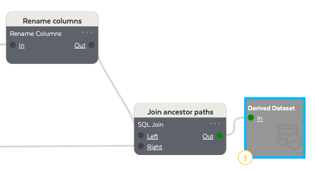

```sql
SELECT
  leftin.`Asset Path`, leftin.`Mapping`, leftin.`Asset Name`, leftin.`Asset Model`, leftin.`Asset Property`
FROM leftin
UNION (
  SELECT rightin.`Asset Path`, rightin.`Mapping`, rightin.`Asset Name`, rightin.`Asset Model`, rightin.`Asset Property`
  FROM rightin
)
```

### Exercise 1.4 - Exporting the data model to AWS IoT SiteWise
To export the data model to AWS IoT SiteWise, refer to [Exporting to AWS IoT SiteWise](#Exporting-to-AWS-IoT-SiteWise).

## Exercise 2 - Single site advanced deployment
A single site advanced deployment involves importing the tag definition file from the edge application into Element Unify with advanced integration of contextual metadata from IT/OT sources. This deployment consists of:

1. Transforming the imported data model
2. Integration of IT/OT metadata - P&IDs
3. Integration of IT/OT metadata - EAM Extract
4. Updating the asset templates
5. Mapping the data model
6. Creating a hierarchy
7. Exporting the data model to AWS IoT SiteWise

The **02. Single Site - Advanced** demo pipeline can be used as a starting point and customized to suit specific project requirements.

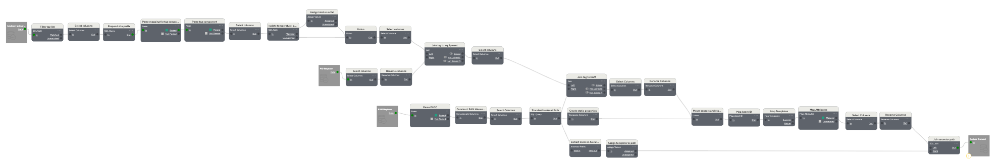

> The single site advanced deployment assumes that the AWS Partner or customer is using Ignition as the third party edge application

### Exercise 2.1 - Transforming the imported data model
Data transformations are used to initially clean and standardize the imported tag definition dataset, as shown below.

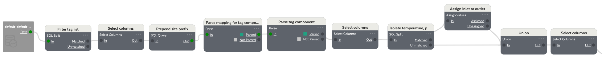

1. Insert the *Ignition Baytown* tag definition dataset into the pipeline.
2. Connect a *SQL Split* transformation. The *SQL Split* transformation is used to filter the tag definition dataset to exclude tags not associated with the data model.
3. Connect a *Select Columns* transformation. The *Select Columns* transformation is used to select the `Name`, `Unit of Measure`columns.
4. Connect a *SQL Query* transformation. The *SQL Query* transformation is used to prepend the `data stream prefix` to the alias mapping and convert any backslashes (\\) with forward slashes (/). The logic is based on the below query.

```sql
SELECT
 `Unit of Measure`,
 REGEXP_REPLACE(CONCAT('Baytown-Primary', `Name`), '(\\\\)','/') AS `Mapping`
FROM in
```

5. Connect a *Parse* transformation. The *Parse* transformation is used to extract the tag component from the `Name` column. The below regular expression (regex) pattern is implemented via the Expression Builder.

```re
^(?i)(.{0}/Tag Providers/default/)([A-Za-z]{1,1})([0-9]{1,2})(\/)([0-9]{1,2})(\/)([A-Za-z0-9]{1,})
```

6. Connect a *Parse* transformation. The *Parse* transformation is used to extract the the tag type and inlet/outlet classification from the `TagComponent` column. The below regular expression (regex) pattern is implemented via the Expression Builder.

```re
^(?i)([0-9]{1,2})([A-Za-z]{1,})([0-9]{1,})([0-9]{1,})
```

7. Connect a *Select Columns* transformation. The *Select Columns* transformation is used to select the `Mapping`, `TagClassification`, `TagComponent`, `TagType`, and `Unit of Measure` columns.
8. Connect a *SQL Split* transformation. The *SQL Split* transformation is used to isolate the pressure, flow, and temperature tags based on the values in the `TagType` column.
9. Connect an *Assign Values* transformation to the pressure, flow, and temperature data flow. The *Assign Values* transformation is used to designate each tag as either an *Inlet* or *Outlet* based on its value in the `Tag Classification` column. For this demo, an **even** number represents an inlet and an **odd** number represents an outlet.
10. Connect a *Union* transformation. The *Union* transformation is used to merge both separate data flows.
11. Connect a *Select Columns* transformation. The *Select Columns* transformation is used to select the `Mapping`, `OutletOrInlet`, `TagComponent`, `TagType`, and `Unit of Measure` columns.

### Exercise 2.2 - Integration of IT/OT metadata - P&IDs
The integration of IT/OT Metadata from P&IDs can further contextualize the data model and provide increased business value, as shown below.

> The P&ID dataset is a sample output from Element's P&ID Productivity Tool, a tool that enables the harvesting of context and asset relationships from P&IDs, and is used to provide a reference to equipment. For more information, the Installation and User Guide can be referenced from the Tools Download page in the Help Docs.

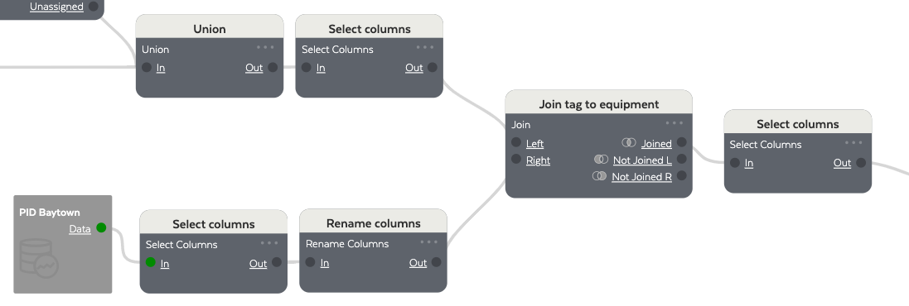

1. Insert the *PID Baytown* dataset into the pipeline.
2. Connect a *Select Columns* transformation. The *Select Columns* transformation is used to select the `associated equipment` and `name` columns.
3. Connect a *Rename Columns* transformation. The *Rename Columns* transformation is used to rename the columns in accordance with the below table.

|Current Column Name|New Column Name|
|-------------------|---------------|
|name|Tag|
|associated equipment|Equipment|

4. Connect a *Join* transformation. THE *Join* transformation is used to integrate the P&ID contextual data with the common data flow based on the `TagComponent` and `Tag` columns.
5. Connect a *Select Columns* transformation. The *Select Columns* transformation is used to select the `Equipment`, `Mapping`, `OutletOrInlet`, `TagComponent`, `TagType`, `Unit of Measure` columns.

### Exercise 2.3 - Integration of IT/OT metadata - EAM
The integration of IT/OT Metadata from EAM systems can further contextualize the data model and provide increased business value, as shown below.


1. Insert the *EAM Baytown* dataset into the pipeline.
2. Connect a *Parse* transformation. The *Parse* transformation is used to extract the equipment name from the `Functional Location` column. The below regular expression (regex) pattern is implemented via the Expression Builder

```re
^(?i)([A-Za-z]{1,3})(\-)([A-Za-z]{1,3})(\-)([0-9]{1,2})(\-)([0-9]{1,2})(\-)([A-Za-z0-9]{1,})
```

3. Connect a *Concatenate Columns* transformation. The *Concatenate Columns* transformation is used to construct an EAM-based hierarchy from the `Region`, `Site`, and `Process` columns.
4. Connect a *Select Columns* transformation. The *Select Columns* transformation is used to select the columns: `Asset Path`, `Asset Type`, `Description`, `Equipment`, `Functional Location`, `Manufacturer`, `Model_Number`.
5. Connect a *SQL Query* transformations. The *SQL Query* transformation is used to standardize the `Asset Path`, such as replacing forward slashes (/) with back slackes (\\). The logic is based on the below query.

```sql
SELECT
  `Asset Type`,
  `Description`,
  `Functional Location`,
  `Manufacturer`,
  `Model_Number`,
  `Equipment`,
  CONCAT('\\', `Asset Path`) AS `Asset Path`
FROM in
```

6. Connect a *Join* transformation. The *Join* transformation is used to integrate the EAM contextual data with the common data flow based on the `Equipment` columns.
7. Connect a *Select Columns* transformation. The *Select Columns* transformation is used to select  the `Asset Path`, `Asset Type`, `left.Equipment`, `Mapping`, `OutletOrInlet`, `TagComponent`, `TagType`, `Unit of Measure` columns.
8. Connect a *Rename Columns* transformation. The *Rename Columns* transformation is used to rename the columns in accordance with the below table.

|Current Column Name|New Column Name|
|-------------------|---------------|
|left.Equipment|Equipment|

9. Connect a *Transpose Columns* transformation. The *Transpose Columns* transformation is used to reshape the data in order to create the EAM static properties, such as manufacturer, model number, description ,and functional location.
10. Connect a *Union* transformation. The *Union* transformation is used to interate the EAM-contextualized data flow with the static properties data flow.

### Exercise 2.4 - Updating Asset Templates
To account for new contextual metadata on an asset template, it must be edited to include the new attributes and/or properties.

The *UnifyUDT/Pump* template should be updated to match the below.


|Attribute Name|Attribute Type|Unit of Measure|Data Type|Property Type|
|--------------|--------------|---------------|---------|-------------|
|Current|Continuous Value|A|Double|Measurement|
|Differential Pressure|Continuous Value|psi|Double|Measurement|
|Inlet Pressure|Continuous Value|psi|Double|Measurement|
|Inlet Temperature|Continuous Value|C|Double|Measurement|
|Inlet Volumetric Flowrate|Continuous Value|ft^3/min|Double|Measurement|
|Outlet Pressure|Continuous Value|psi|Double|Measurement|
|Outlet Temperature|Continuous Value|C|Double|Measurement|
|Outlet Volumetric Flowrate|Continuous Value|ft^3/min|Double|Measurement|
|Power|Continuous Value|kW|Double|Measurement|
|Rotational Speed|Continuous Value|rpm|Double|Measurement|
|Description|Continuous Value||String|Static|
|Functional Location|Continuous Value||String|Static|
|Manufacturer|Continuous Value||String|Static|
|Model Number|Continuous Value||String|Static|

The *UnifyUDT/Compressor* template should be updated to match the below.


|Attribute Name|Attribute Type|Unit of Measure|Data Type|Property Type|
|--------------|--------------|---------------|---------|-------------|
|Current|Continuous Value|A|Double|Measurement|
|Differential Pressure|Continuous Value|psi|Double|Measurement|
|Inlet Pressure|Continuous Value|psi|Double|Measurement|
|Inlet Temperature|Continuous Value|C|Double|Measurement|
|Inlet Volumetric Flowrate|Continuous Value|ft^3/min|Double|Measurement|
|Outlet Pressure|Continuous Value|psi|Double|Measurement|
|Outlet Temperature|Continuous Value|C|Double|Measurement|
|Outlet Volumetric Flowrate|Continuous Value|ft^3/min|Double|Measurement|
|Power|Continuous Value|kW|Double|Measurement|
|Rotational Speed|Continuous Value|rpm|Double|Measurement|
|Description|Continuous Value||String|Static|
|Functional Location|Continuous Value||String|Static|
|Manufacturer|Continuous Value||String|Static|
|Model Number|Continuous Value||String|Static|

The *measurement* attributes should be configured with the below parameters.

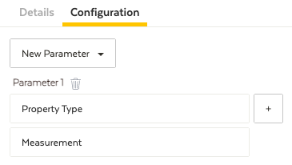

The *static* attributes should be configured with the below parameters. The default value is generically set to the name of the attribute.

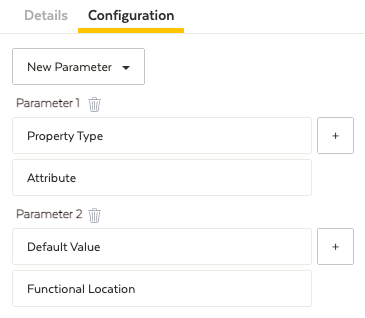

### Exercise 2.5 - Mapping the data model
The data model is mapped to specific templates and attributes using the purpose built mapping transformations, as shown below.

> Refer to [Mapping Process](#mapping-process) for more information


1. Connect a *Map Asset ID* transformation. The *Map Asset ID* transformation is used to create a unique ID for each asset based on the `Equipment` column.
2. Connect a *Map Templates* tranformation. The *Map Templates* transformation is used to map the asset model to a specific template based on the `Asset Type` column.
3. Connect a *Map Attributes* transformation. The *Map Attributes* transformation is used to map the sensor aliases or static properties to specific attributes on a template based on the `TagType`, `OutletOrInlet`, and `Property Name` columns.
4. Connect a *Select Columns* transformation. The *Select Columns* transformation is used to select the `Asset Path`, `EQUIPMENT_ID *`, `Mapping`, `SENSOR *`, and `TEMPLATE *` columns.
5. Connect a *Rename Columns* transformation. The *Rename Columns* transformation is used to rename the columns in accordance with the below table.

|Current Column Name|New Column Name|
|-------------------|---------------|
|TEMPLATE *|Asset Model|
|EQUIPMENT_ID *|Asset Name|
|SENSOR *|Asset Property|

### Exercise 2.6 - Creating a hierarchy
A hierarchy for the data model is created from the tag definition dataset by using the *Ancestor Path* function, as shown below.

> Refer to [Assign mappings to each level of the hierarchy](#assign-mappings-to-each-level-of-the-hierarchy) for more information.


1. Insert the *Ancestor Path* function. The *Ancestor Path* function is used to extract each level in the hierarchy and should be connected to the transformation with the label *Standardize Asset Path*.
2. Connect an *Assign Values* transformation. The *Assign Values* transformation is used to assign each level in the hierarchy to a template. The assignments are based on the table below.

|Hierarchy Level|Asset Model|
|---------------|-----------|
|Baytown|Site|
|Conversion|Process|
|North America|Region|
|Separation|Process|
|Treatment|Process|

> The assigned template must be configured in the Template Library. The `unify_udt_templates.csv` and `unify_udt_configuration.csv` files can be uploaded to Element Unify to configure the required templates and attributes.

4. Connect a *SQL Join* transformation. The *SQL Join* transformation is used to merge the ancestor paths into the common data flow and should be implemented near the end of the pipeline. The logic is based on the query below.

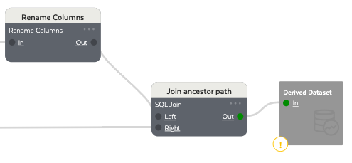

```sql
SELECT
  leftin.`Asset Path`, leftin.`Mapping`, leftin.`Asset Name`, leftin.`Asset Model`, leftin.`Asset Property`
FROM leftin
UNION (
  SELECT rightin.`Asset Path`, rightin.`Mapping`, rightin.`Asset Name`, rightin.`Asset Model`, rightin.`Asset Property`
  FROM rightin
)
```

### Exercise 2.7 - Exporting the data model to AWS IoT SiteWise
To export the data model to AWS IoT SiteWise, refer to [Deploying the data model to AWS IoT SiteWise](#Deploying-the-data-model-to-AWS-IoT-SiteWise).

## Exercise 3 - Multiple site advanced deployment
A multiple site advanced deployment involves importing the tag definition file from multiple edge applications into Element Unify with advanced integration of contextual metadata from IT/OT sources. This deployment consists of:

1. Transforming the imported data model
2. Integration of IT/OT metadata - P&IDs
3. Integration of IT/OT metadata - EAM Extract
4. Updating the asset templates
5. Mapping the data model
6. Creating a hierarchy
7. Exporting the data model to AWS IoT SiteWise

The **03. Multiple Site - Advanced** demo pipeline can be used as a starting point and customized to suit specific project requirements.

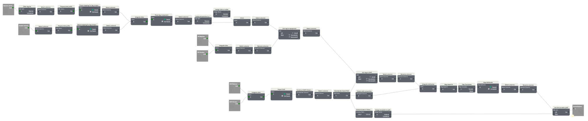

> The multiple site advanced deployment assumes that the AWS Partner or customer is using Ignition as the third party edge application

### Exercise 3.1 - Transforming the imported data model
Data transformations are used to initially clean and standardize the imported tag definition dataset, as shown below.

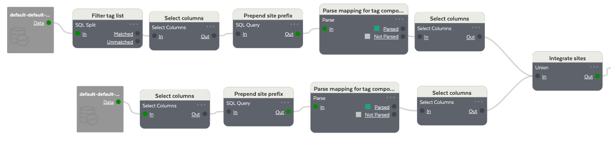

**Baytown Site**
1. Insert the *Ignition Baytown* tag definition dataset into the pipeline.
2. Connect a *SQL Split* transformation. The *SQL Split* transformation is used to filter the tag definition dataset to exclude tags not associated with the data model.
3. Connect a *Select Columns* transformation. The *Select Columns* transformation is used to select the `Name`, `Unit of Measure`columns.
4. Connect a *SQL Query* transformation. The *SQL Query* transformation is used to prepend the `data stream prefix` to the alias mapping and convert any backslashes (\\) with forward slashes (/). The logic is based on the below query.

```sql
SELECT
  `Unit of Measure`,
  REGEXP_REPLACE(CONCAT('Baytown-Primary', `Name`), '(\\\\)','/') AS `Mapping`
FROM in
```

5. Connect a *Parse* transformation. The *Parse* transformation is used to extract the tag component from the `Name` column. The below regular expression (regex) pattern is implemented via the Expression Builder.

```re
^(?i)(.{0}/Tag Providers/default/)([A-Za-z]{1,1})([0-9]{1,2})(\/)([0-9]{1,2})(\/)([A-Za-z0-9]{1,})
```

6. Connect a *Select Columns* transformation. The *Select Columns* transformation is used to select the `Mapping`, `TagComponent`, and `Unit of Measure` columns.

**Houston Site**
1. Insert the *Ignition Houston* tag definition dataset into the pipeline.
2. Connect a *Select Columns* transformation. The *Select Columns* transformation is used to select the `Name` and `Unit of Measure` columns.
3. Connect a *Select Columns* transformation. The *Select Columns* transformation is used to select the `Name`, `Unit of Measure`columns.
4. Connect a *SQL Query* transformation. The *SQL Query* transformation is used to prepend the `data stream prefix` to the alias mapping and convert any backslashes (\\) with forward slashes (/). The logic is based on the below query.

```sql
SELECT
  `Unit of Measure`,
  REGEXP_REPLACE(CONCAT('Houston-Secondary', `Name`), '(\\\\)','/') AS `Mapping`
FROM in
```

5. Connect a *Parse* transformation. The *Parse* transformation is used to extract the tag component from the `Name` column. The below regular expression (regex) pattern is implemented via the Expression Builder.

```re
^(?i)(.{0}/Tag Providers/default/)([A-Za-z]{1,1})([0-9]{1,2})(\/)([0-9]{1,2})(\/)([A-Za-z0-9]{1,})
```

6. Connect a *Select Columns* transformation. The *Select Columns* transformation is used to select the `Mapping`, `TagComponent`, and `Unit of Measure` columns.

**Integrated data flow**

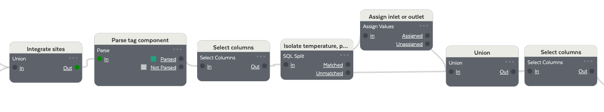

1. Connect a *Union* transformation. The *Union* transformation is used to merge the data flows from each site into a single data flow.
2. Connect a *Parse* transformation. The *Parse* transformation is used to extract the the tag type and inlet/outlet classification from the `TagComponent` column. The below regular expression (regex) pattern is implemented via the Expression Builder.

```re
^(?i)([0-9]{1,2})([A-Za-z]{1,})([0-9]{1,})([0-9]{1,})
```

3. Connect a *Select Columns* transformation. The *Select Columns* transformation is used to select the `Mapping`, `TagClassification`, `TagComponent`, `TagType`, and `Unit of Measure` columns.
4. Connect a *SQL Split* transformation. The *SQL Split* transformation is used to isolate the pressure, flow, and temperature tags based on the values in the `TagType` column.
5. Connect an *Assign Values* transformation to the pressure, flow, and temperature data flow. The *Assign Values* transformation is used to designate each tag as either an *Inlet* or *Outlet* based on its value in the `Tag Classification` column. For this demo, an **even** number represents an inlet and an **odd** number represents an outlet.
6. Connect a *Union* transformation. The *Union* transformation is used to merge both separate data flows.
7. Connect a *Select Columns* transformation. The *Select Columns* transformation is used to select the `Mapping`, `OutletOrInlet`, `TagComponent`, `TagType`, and `Unit of Measure` columns.

### Exercise 3.2 - Integration of IT/OT metadata - P&IDs
The integration of IT/OT Metadata from P&IDs can further contextualize the data model and provide increased business value, as shown below.

> The P&ID dataset is a sample output from Element's P&ID Productivity Tool, a tool that enables the scraping of P&IDs for context, and is used to provide a reference to equipment.

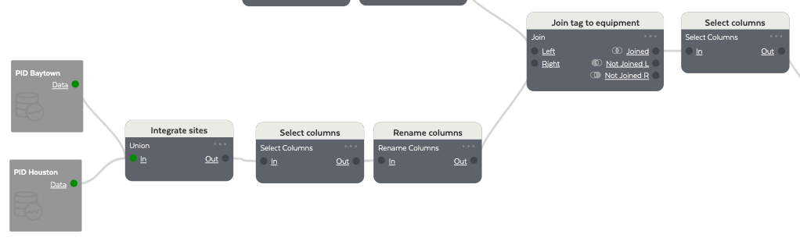

**Baytown Site**
1. Insert the *PID Baytown* dataset into the pipeline.

**Houston Site**
1. Insert the *PID Houston* dataset into the pipeline.

**Integrated data flow**
1. Connect a *Union* transformation. The *Union* transformation is used to merge the data flows from each site into a single data flow.
2. Connect a *Select Columns* transformation. The *Select Columns* transformation is used to select the `associated equipment` and `name` columns.
3. Connect a *Rename Columns* transformation. The *Rename Columns* transformation is used to rename the columns in accordance with the below table.

|Current Column Name|New Column Name|
|-------------------|---------------|
|name|Tag|
|associated equipment|Equipment|

4. Connect a *Join* transformation. THE *Join* transformation is used to integrate the P&ID contextual data with the common data flow based on the `TagComponent` and `Tag` columns.
5. Connect a *Select Columns* transformation. The *Select Columns* transformation is used to select the `Equipment`, `Mapping`, `OutletOrInlet`, `TagComponent`, `TagType`, `Unit of Measure` columns.

### Exercise 3.3 - Integration of IT/OT metadata - EAM
The integration of IT/OT Metadata from EAM systems can further contextualize the data model and provide increased business value, as shown below.

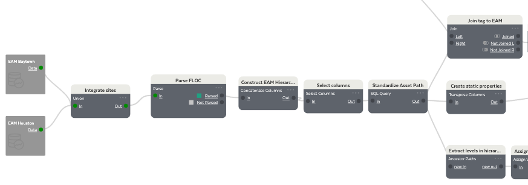

**Baytown Site**
1. Insert the *EAM Baytown* dataset into the pipeline.

**Houston Site**
1. Insert the *EAM Houston* dataset into the pipeline.

**Integrated data flow**
1. Connect a *Union* transformation. The *Union* transformation is used to merge the data flows from each site into a single data flow.
2. Connect a *Parse* transformation. The *Parse* transformation is used to extract the equipment name from the `Functional Location` column. The below regular expression (regex) pattern is implemented via the Expression Builder

```re
^(?i)([A-Za-z]{1,3})(\-)([A-Za-z]{1,3})(\-)([0-9]{1,2})(\-)([0-9]{1,2})(\-)([A-Za-z0-9]{1,})
```

3. Connect a *Concatenate Columns* transformation. The *Concatenate Columns* transformation is used to construct an EAM-based hierarchy from the `Region`, `Site`, and `Process` columns.
4. Connect a *Select Columns* transformation. The *Select Columns* transformation is used to select the columns: `Asset Path`, `Asset Type`, `Description`, `Equipment`, `Functional Location`, `Manufacturer`, `Model_Number`.
5. Connect a *SQL Query* transformations. The *SQL Query* transformation is used to standardize the `Asset Path`, such as replacing forward slashes (/) with back slackes (\\). The logic is based on the below query.

```sql
SELECT
  `Asset Type`,
  `Description`,
  `Functional Location`,
  `Manufacturer`,
  `Model_Number`,
  `Equipment`,
  CONCAT('\\', `Asset Path`) AS `Asset Path`
FROM in
```

6. Connect a *Join* transformation. The *Join* transformation is used to integrate the EAM contextual data with the common data flow based on the `Equipment` columns.
7. Connect a *Select Columns* transformation. The *Select Columns* transformation is used to select  the `Asset Path`, `Asset Type`, `left.Equipment`, `Mapping`, `OutletOrInlet`, `TagComponent`, `TagType`, `Unit of Measure` columns.
8. Connect a *Rename Columns* transformation. The *Rename Columns* transformation is used to rename the columns in accordance with the below table.

|Current Column Name|New Column Name|
|-------------------|---------------|
|left.Equipment|Equipment|

9. Connect a *Transpose Columns* transformation. The *Transpose Columns* transformation is used to reshape the data in order to create the EAM static properties, such as manufacturer, model number, description ,and functional location.
10. Connect a *Union* transformation. The *Union* transformation is used to interate the EAM-contextualized data flow with the static properties data flow.

### Exercise 3.4 - Updating Asset Templates
To account for new contextual metadata on an asset template, it must be edited to include the new attributes and/or properties.

The *UnifyUDT/Pump* template should be updated to match the below.


|Attribute Name|Attribute Type|Unit of Measure|Data Type|Property Type|
|--------------|--------------|---------------|---------|-------------|
|Current|Continuous Value|A|Double|Measurement|
|Differential Pressure|Continuous Value|psi|Double|Measurement|
|Inlet Pressure|Continuous Value|psi|Double|Measurement|
|Inlet Temperature|Continuous Value|C|Double|Measurement|
|Inlet Volumetric Flowrate|Continuous Value|ft^3/min|Double|Measurement|
|Outlet Pressure|Continuous Value|psi|Double|Measurement|
|Outlet Temperature|Continuous Value|C|Double|Measurement|
|Outlet Volumetric Flowrate|Continuous Value|ft^3/min|Double|Measurement|
|Power|Continuous Value|kW|Double|Measurement|
|Rotational Speed|Continuous Value|rpm|Double|Measurement|
|Description|Continuous Value||String|Static|
|Functional Location|Continuous Value||String|Static|
|Manufacturer|Continuous Value||String|Static|
|Model Number|Continuous Value||String|Static|

The *UnifyUDT/Compressor* template should be updated to match the below.


|Attribute Name|Attribute Type|Unit of Measure|Data Type|Property Type|
|--------------|--------------|---------------|---------|-------------|
|Current|Continuous Value|A|Double|Measurement|
|Differential Pressure|Continuous Value|psi|Double|Measurement|
|Inlet Pressure|Continuous Value|psi|Double|Measurement|
|Inlet Temperature|Continuous Value|C|Double|Measurement|
|Inlet Volumetric Flowrate|Continuous Value|ft^3/min|Double|Measurement|
|Outlet Pressure|Continuous Value|psi|Double|Measurement|
|Outlet Temperature|Continuous Value|C|Double|Measurement|
|Outlet Volumetric Flowrate|Continuous Value|ft^3/min|Double|Measurement|
|Power|Continuous Value|kW|Double|Measurement|
|Rotational Speed|Continuous Value|rpm|Double|Measurement|
|Description|Continuous Value||String|Static|
|Functional Location|Continuous Value||String|Static|
|Manufacturer|Continuous Value||String|Static|
|Model Number|Continuous Value||String|Static|

The *measurement* attributes should be configured with the below parameters.


The *static* attributes should be configured with the below parameters. The default value is generically set to the name of the attribute.


### Exercise 3.5 - Mapping the data model
The data model is mapped to specific templates and attributes using the purpose built mapping transformations, as shown below.

> Refer to [Mapping Process](#mapping-process) for more information


1. Connect a *Map Asset ID* transformation. The *Map Asset ID* transformation is used to create a unique ID for each asset based on the `Equipment` column.
2. Connect a *Map Templates* tranformation. The *Map Templates* transformation is used to map the asset model to a specific template based on the `Asset Type` column.
3. Connect a *Map Attributes* transformation. The *Map Attributes* transformation is used to map the sensor aliases or static properties to specific attributes on a template based on the `TagType`, `OutletOrInlet`, and `Property Name` columns.
4. Connect a *Select Columns* transformation. The *Select Columns* transformation is used to select the `Asset Path`, `EQUIPMENT_ID *`, `Mapping`, `SENSOR *`, and `TEMPLATE *` columns.
5. Connect a *Rename Columns* transformation. The *Rename Columns* transformation is used to rename the columns in accordance with the below table.

|Current Column Name|New Column Name|
|-------------------|---------------|
|TEMPLATE *|Asset Model|
|EQUIPMENT_ID *|Asset Name|
|SENSOR *|Asset Property|

### Exercise 3.6 - Creating a hierarchy
A hierarchy for the data model is created from the tag definition dataset by using the *Ancestor Path* function, as shown below.

> Refer to [Assign mappings to each level of the hierarchy](#assign-mappings-to-each-level-of-the-hierarchy) for more information.

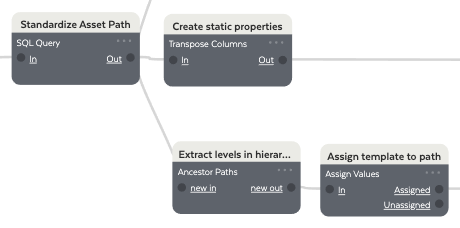

1. Insert the *Ancestor Path* function. The *Ancestor Path* function is used to extract each level in the hierarchy and should be connected to the transformation with the label *Construct EAM Hierarchy*.
2. Connect an *Assign Values* transformation. The *Assign Values* transformation is used to assign each level in the hierarchy to a template. The assignments are based on the table below.

|Hierarchy Level|Asset Model|
|---------------|-----------|
|Baytown|Site|
|Conversion|Process|
|Export|Process|
|Houston|Site|
|North America|Region|
|Processing|Process|
|Separation|Process|
|Treatment|Process|
|Upgrading|Process|

> The assigned template must be configured in the Template Library. The `unify_udt_templates.csv` and `unify_udt_configuration.csv` files can be uploaded to Element Unify to configure the required templates and attributes.

4. Connect a *SQL Join* transformation. The *SQL Join* transformation is used to merge the ancestor paths into the common data flow and should be implemented near the end of the pipeline. The logic is based on the query below.

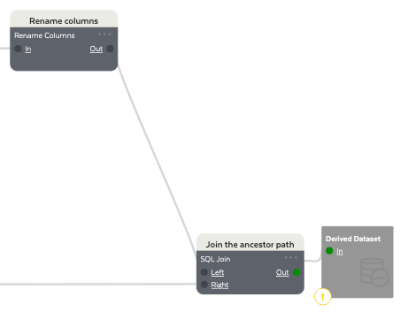

```sql
SELECT
  leftin.`Asset Path`, leftin.`Mapping`, leftin.`Asset Name`, leftin.`Asset Model`, leftin.`Asset Property`
FROM leftin
UNION (
  SELECT rightin.`Asset Path`, rightin.`Mapping`, rightin.`Asset Name`, rightin.`Asset Model`, rightin.`Asset Property`
  FROM rightin
)
```

### Exercise 3.7 - Exporting the data model to AWS IoT SiteWise
To export the data model to AWS IoT SiteWise, refer to [Deploying the data model to AWS IoT SiteWise](#Deploying-the-data-model-to-AWS-IoT-SiteWise).