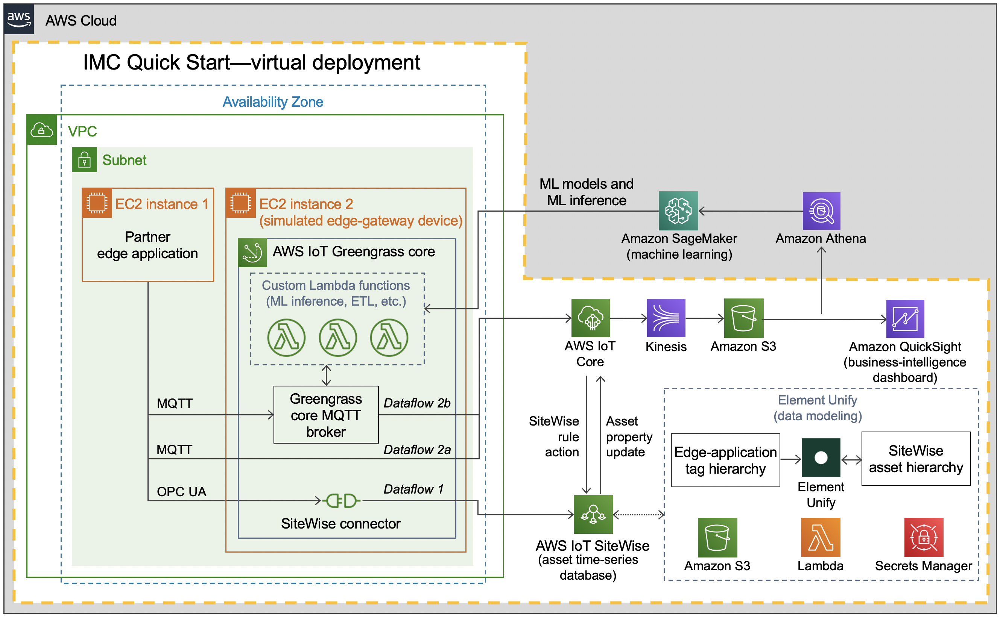
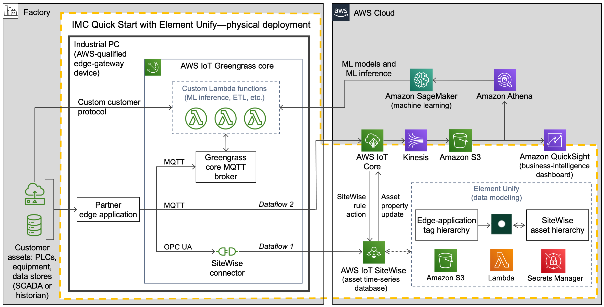
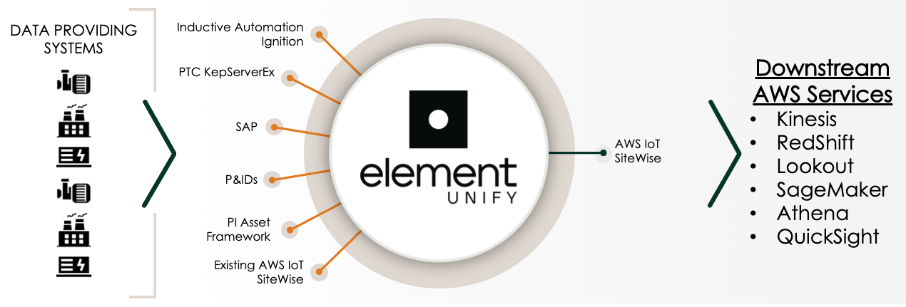
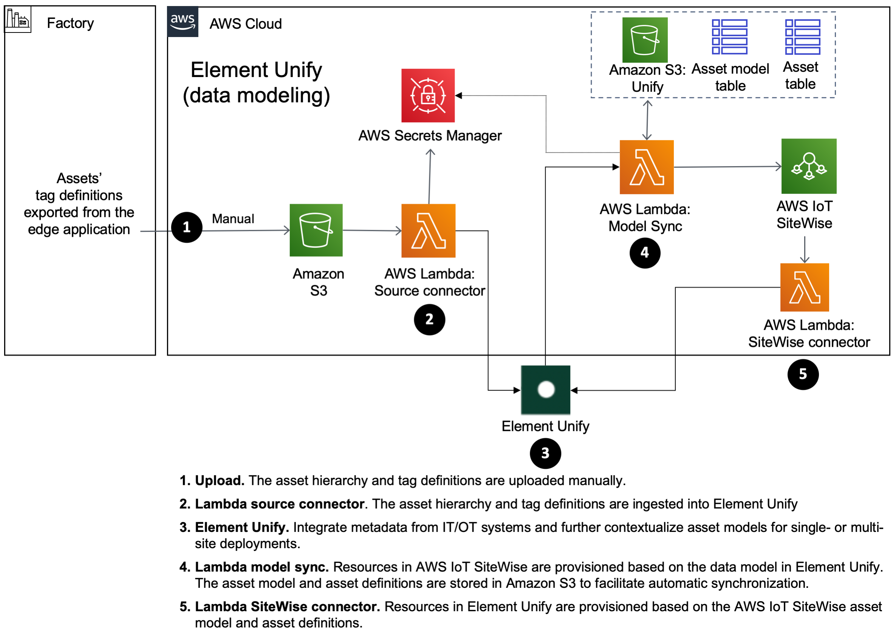

:xrefstyle: short

=== Virtual deployment

When you deploy this Quick Start with AMC in virtual mode, you build the following {partner-product-name} environment in the AWS Cloud. Elements of the Quick Start are outlined in the dotted orange box.

[#architecture-virtual]
.Architecture of the {partner-product-short-name} Quick Start with AMC—virtual deployment
image::../images/IMCQuickStartArchitecture-Virtual.png[Virtual architecture]

As shown in <<architecture-virtual>>, the virtual deployment of the {partner-product-short-name} Quick Start sets up the following:

* **A virtual private cloud (VPC).** The VPC is configured with a public subnet within a single Availability Zone. The {partner-product-short-name} Quick Start can be launched in the default VPC of your existing AWS infrastructure, or it can generate a new VPC.*
* In the subnet:
** **EC2 instance 1.** This instance is for the partner edge application.
** **EC2 instance 2.** This instance is for the AWS IoT Greengrass core.* It simulates the edge-gateway device (industrial PC) that would run on the customer’s premises. When you launch the Quick Start, you configure this Greengrass group for the dataflow option that suits your use case. Dataflow options are the data-ingestion paths available with this architecture. These are the two dataflow options:
*** **Dataflow option 1.** This path sends data from the partner edge application's OPC UA server to AWS IoT SiteWise. Data flows through the AWS IoT SiteWise connector running in an AWS IoT Greengrass core directly into AWS IoT SiteWise. 
*** **Dataflow option 2a.** This path sends data from the partner edge application—for example, Ignition with the Cirrus Link MQTT transmission module—directly to AWS IoT Core.
* **Asset Model Converter.** The AMC is a serverless, module-based framework that uses Amazon S3, Amazon DynamoDB, and Lambda to map the partner edge application's asset-modeling conventions onto AWS IoT SiteWise. When you launch the Quick Start, the AMC automatically converts data from the partner edge application's asset-hierarchy definition object (a JSON file with definitions for factory, lines, machines, and tags) into AWS IoT SiteWise models and assets. For details, see <<amc-architecture>>. 
* **AWS IoT SiteWise.** With this managed service, you can collect, model, analyze, and visualize data from industrial equipment at scale. The service, which maintains the asset hierarchy's metadata, contains a managed database for all the time-series data generated by the customer assets. It includes a SaaS dashboard-building feature called AWS IoT SiteWise Monitor. You use SiteWise Monitor to build custom dashboards, or portals, to view and share near-real-time data from your connected devices and equipment.
* **AWS IoT Core.** This service receives and routes MQTT messages either directly from the partner edge application or from the AWS IoT Greengrass core.
* **Amazon Kinesis Data Firehose.** This service routes data messages from AWS IoT Core to an Amazon S3 bucket.
* **Amazon S3.** The S3 bucket can serve as a cold-storage tier for data.
* **Amazon QuickSight.** You use this service to build custom business-intelligence dashboards and visualizations for data stored in the S3 bucket. 

When you deploy this Quick Start with Element Unify in virtual mode, you build the following {partner-product-name} environment in the AWS Cloud. Components of the Quick Start with Element Unify are outlined in the dotted orange box.

[#architecture-element-virtual]
.Architecture of the {partner-product-short-name} Quick Start with Element Unify-virtualdeployment

In addition to what is shown in <<architecture-virtual>>, the virtual deployment of the {partner-product-short-name} Quick Start with Element Unify sets up the following:

* **Element Unify module.** This is a serverless, module-based, framework that includes Amazon S3 bucket, AWS Lambda function and AWS Secrets Manager to automate the import of the partner edge application's metadata structure onto Element Unify prior to deployment to AWS IoT SiteWise. Metadata is converted from the partner edge application's asset-hierarchy definition object (a JSON file with definitions for factory, lines, machines, and tags) as datasets and asset templates in Element Unify. An AWS Partner or customer can then utilize Element Unify to manage the data model or integrate contextualization with metadata from IT/OT systems before creating AWS IoT SiteWise models and assets. For details, see <<element-unify-architecture>>.

[.small]#* The template that deploys the Quick Start into an existing VPC skips the components marked by asterisks and prompts you for your existing VPC configuration.#

=== Physical deployment

When you deploy this Quick Start with AMC in physical mode (on the customer's premises, such as in a factory), you build an environment like the one shown in <<architecture-physical>>. Elements of the Quick Start are outlined in the dotted orange box.

[#architecture-physical]
.Architecture of the {partner-product-short-name} Quick Start with AMC—physical deployment
image::../images/IMCQuickStartArchitecture-Physical.png[Physical architecture]

Unlike the virtual deployment (<<architecture-virtual>>), the physical deployment (<<architecture-physical>>) has the AWS IoT Greengrass core running on an industrial PC on the customer's premises. The physical deployment uses the same resources as the virtual deployment with the following differences:

* In physical deployments, no EC2 instances are launched in a VPC. Instead, AWS IoT Greengrass core runs directly onto an industrial PC. IoT Greengrass core is installed by a bootstrap installation script that is created during the {partner-product-short-name} Quick Start's CloudFormation stack launch.
* In physical deployments, the partner edge application communicates with customer assets—PLCs, equipment, data stores, and other IoT devices—running in the factory.  

When you deploy this Quick Start with Element Unify in physical mode (on the customer's premises, such as in a factory), you build an environment like the one shown in <<architecture-element-physical>>. Elements of the Quick Start are outlined in the dotted orange box.

[#architecture-element-physical]
.Architecture of the {partner-product-short-name} Quick Start with Element Unify—physical deployment

=== The Asset Model Converter

For both virtual and physical architectures, at the heart of the {partner-product-short-name} Quick Start is the Asset Model Converter (AMC), detailed in <<amc-architecture>>. The AMC is a serverless, module-based framework. It automatically converts definitions of a customer's asset hierarchy (factory, lines, machines, and tags) from the partner edge application to equivalent definitions in AWS IoT SiteWise models and assets. 

[#amc-architecture]
[link=images/AMCArchitecture.png]
.AMC architecture diagram
image::../images/AMCArchitecture.png[AMC architecture]

The AMC architecture, shown in <<amc-architecture>>, has a serverless sequence flow. The AMC ingests asset-hierarchy-definition files or messages generated by the partner edge application and converts them into a schema compatible with AWS IoT SiteWise. It then automatically provisions a matching asset hierarchy (factory, lines, machines, and tags) in AWS IoT SiteWise. With this automatic mapping, application builders have immediate access to the customer's asset hierarchy within a managed service (AWS IoT SiteWise) in the AWS Cloud. These application builders may be the customer's own developers, regional or global systems integrators, or an AWS ProServe team. 

=== Element Unify

Element Unify is a data management platform to integrate, contextualize, and govern industrial IT/OT data, and standardize the data into analyics-ready data sources and asset models. Element Unify allows industrial, SI, and GSI teams to work collaboratively to build rich data context at scale with no-code, supporting single site and multiple site deployments. Element Unify automates the deployment and updates of the data model directly to AWS IoT SiteWise.

Element Unify provides a single federated, contextualized source of data from which users can establish their own single version of the truth, all with a powerful governance engine ensuring data integrity across the enterprise.

By aligning and scaling critial IT/OT data, as depicted in <<element-unify-itot-together>>, the value of data is unlocked, enabling the delivery of high impact, enterprise-wide analytics that improve core business performance outcomes like asset flexibility, security, reliability, safety, and cost.

[#element-unify-itot-together]
[link=images/ElementUnifyBringingITOTTogether.png]
.Element Unify bring together IT/OT data for AWS

The deployment of Element Unify in the Quick Start is detailed in <<element-unify-architecture>>. The architecture is based on a serverless, module-based framework. It automatically converts data from the partner edge application’s asset-hierarchy (factory, lines, machines, and tags) to equivalent definitions in Element Unify and AWS IoT SiteWise.

[#element-unify-architecture]
[link=images/ElementUnifyArchitecture.png]
.Element Unify architecture diagram

The architecture, shown in <<element-unify-architecture>>, has a serverless sequence flow. A source connector ingests the asset-hierarchy definition or tag definition files generated by the partner edge application and converts it into a schema compatible with Element Unify. An AWS Partner or customer can then use Element Unify to manage industral data models and assets for either single site or multiple site deployments at scale. Element Unify contextualizes metadata from edge sources, maps them to complex asset templates and asset hierarchies. An AWS Lambda automatically provisions a matching asset hierarchy (factory, lines, machines, and tags) to AWS IoT SiteWise. This Lambda runs hourly, continuously monitoring both Element Unify and AWS IoT SiteWise to synchronize the underlying data model and maintain an evergreen state.