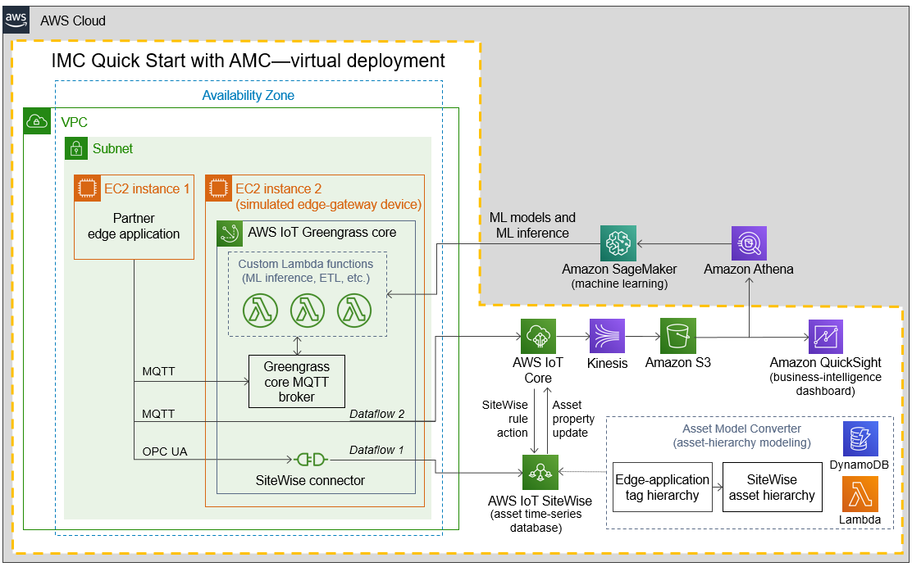
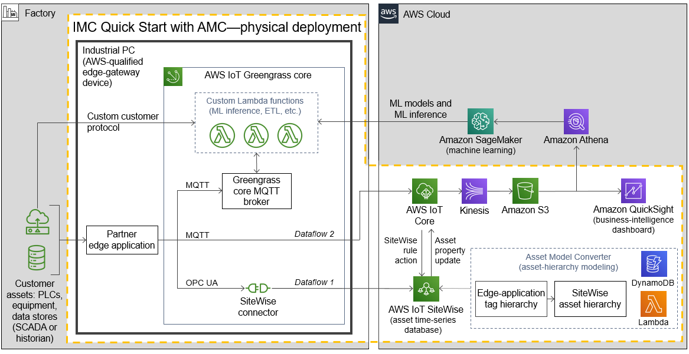

:xrefstyle: short

Depending on whether you deploy in virtual or physical mode and whether you choose the Asset Model Converter (AMC) or the https://www.elementanalytics.com/solutions/element-unify-for-aws[Element Unify^] module from Element Analytics, Inc., you deploy this Quick Start with one of the following architectures:

* link:#_virtual_deployment_with_amc[Virtual deployment with AMC]
* link:#_virtual_deployment_with_element_unify[Virtual deployment with Element Unify] 
* link:#_physical_deployment_with_amc[Physical deployment with AMC]
* link:#_physical_deployment_with_element_unify[Physical deployment with Element Unify]

For the difference between virtual and physical deployments, see link:#_industrial_machine_connectivity_on_aws[Industrial Machine Connectivity on AWS] earlier in this guide.

The AMC module converts definitions of a customer's asset hierarchy (factory, lines, machines, and tags) from the partner edge application to equivalent definitions in AWS IoT SiteWise models and assets. The Element Unify module increases data-modeling and metadata-integration capabilities. It uses a low-code/no-code (LCNC) approach to building and publishing models to AWS IoT SiteWise.

//TODO Shivansh, Throughout this doc, we call Element Unify various things: an "adapter," a "module," a "driver" (maybe), a "framework," and an "asset-modeling application." Best practice is to use the same word consistently for a given meaning. When should we use which word? Which redundant words should we avoid?

//TODO Shivansh, Ditto for AMD: Which of these words applies when?

=== Virtual deployment with AMC

When you deploy this Quick Start with AMC in virtual mode, you build the following {partner-product-name} environment in the AWS Cloud. Elements of the Quick Start are outlined in the dotted orange box.

[#architecture-AMC-virtual]
.Architecture of the {partner-product-short-name} Quick Start with AMC—virtual deployment

As shown in <<architecture-AMC-virtual>>, the virtual deployment of the {partner-product-short-name} Quick Start sets up the following:

* **A virtual private cloud (VPC).** The VPC is configured with a public subnet within a single Availability Zone. The {partner-product-short-name} Quick Start can be launched in the default VPC of your existing AWS infrastructure, or it can generate a new VPC.*
* In the subnet:
** **EC2 instance 1.** This instance is for the partner edge application.
** **EC2 instance 2.** This instance is for the AWS IoT Greengrass core.* It simulates the edge-gateway device (industrial PC) that would run on the customer’s premises. When you launch the Quick Start, you configure this Greengrass group for the dataflow option that suits your use case. Dataflow options are the data-ingestion paths available with this architecture. These are the two dataflow options:
*** **Dataflow 1.** This path sends data from the partner edge application's OPC UA server to AWS IoT SiteWise. Data flows through the AWS IoT SiteWise connector running in an AWS IoT Greengrass core directly into AWS IoT SiteWise. 
*** **Dataflow 2.** This path sends data from the partner edge application—for example, Ignition with the Cirrus Link MQTT transmission module—directly to AWS IoT Core.
* **Asset Model Converter.** The AMC is a serverless, module-based framework that uses Amazon S3, Amazon DynamoDB, and Lambda to map the partner edge application's asset-modeling conventions onto AWS IoT SiteWise. When you launch the Quick Start, the AMC automatically converts data from the partner edge application's asset-hierarchy definition object (a JSON file with definitions for factory, lines, machines, and tags) into AWS IoT SiteWise models and assets. For details, see <<amc-architecture>>. 
* **AWS IoT SiteWise.** With this managed service, you can collect, model, analyze, and visualize data from industrial equipment at scale. The service, which maintains the asset hierarchy's metadata, contains a managed database for all the time-series data generated by the customer assets. It includes a SaaS dashboard-building feature called AWS IoT SiteWise Monitor. You use SiteWise Monitor to build custom dashboards, or portals, to view and share near-real-time data from your connected devices and equipment.
* **AWS IoT Core.** This service receives and routes MQTT messages either directly from the partner edge application or from the AWS IoT Greengrass core.
* **Amazon Kinesis Data Firehose.** This service routes data messages from AWS IoT Core to an Amazon S3 bucket.
* **Amazon S3.** The S3 bucket can serve as a cold-storage tier for data.
* **Amazon QuickSight.** You use this service to build custom business-intelligence dashboards and visualizations for data stored in the S3 bucket. 

[.small]#* The template that deploys the Quick Start into an existing VPC skips the components marked by asterisks and prompts you for your existing VPC configuration.#

//TODO Shivansh, Some of the code files still refer to "option 2a" and "option 2b." Please address throughout the code. For example, the following lines appear in .taskcat.yml:

//  # VOption2a:
//  #   parameters:
//  #     DeploymentType: Virtual
//  #     DeploymentOption: Option2a
//  #   regions:
//  #     - us-west-2

//  # VOption2b:
//  #   parameters:
//  #     DeploymentType: Virtual
//  #     DeploymentOption: Option2b
//  #   regions:
//  #     - eu-west-1

// Another example: these lines appear in VirtualUnify.template.yaml:

//  DeploymentOption:
//    Description: They further defined deployment type
//      --- Option1 (or OPC-UA Path via SiteWise)
//      --- Option 2a (MQTT Ignition --> Iot Core)
//      --- Option 2b (MQTT Ignition --> Greengrass --> Iot Core)

=== Virtual deployment with Element Unify

When you deploy this Quick Start with Element Unify in virtual mode, as shown in <<architecture-element-virtual>>, you build the following {partner-product-name} environment in the AWS Cloud. Components of the Quick Start with Element Unify are outlined in the dotted orange box. 

[#architecture-element-virtual]
.Architecture of the {partner-product-short-name} Quick Start with Element Unify—virtual deployment
image::../images/IMCQuickStartArchitecture-ElementUnify-Virtual.png[Virtual Element Unify architecture]

//TODO Shivansh, The architecture-element-virtual diagram still shows dataflow 2a and 2b; please update the dataflows. 

//TODO Shivansh, In the diagram, update the title inside the yellow dotted lines to say "IMC Quick Start with Element Unify—virtual deployment." 

//TODO Shivansh, In the diagram, I suggest that we remove the Element Unify logo since we removed the other non-AWS logos. If it's important to use that logo, please paste their written permission into SIM. My recommendation: (1) Replace the logo with a simple box labeled "Element Unify." (2) In the title of the larger dotted box, add the word "module" after "Element Unify" so that those two labels are distinct.

//TODO Shivansh, In the diagram, the Element Unify logo (to be replaced with a box?) should be outside the AWS Cloud box, correct? 

//TODO Shivansh, Add this diagram to the .pptx file; the source diagram is missing. I've updated the .pptx file, so make sure to add it to the CURRENT file in the repo. 

//TODO Shivansh, Make sure that the .png file is high-res enough to be legible. 

This architecture, which is similar to the one shown in <<architecture-AMC-virtual>>, uses Element Unify instead of AMC. The Element Unify module includes an Amazon S3 bucket, an AWS Lambda function, and AWS Secrets Manager. This framework automatically imports the partner edge application's metadata structure into Element Unify prior to deployment to AWS IoT SiteWise. Metadata is converted from the partner edge application's asset-hierarchy definition object (a JSON file with definitions for factory, lines, machines, and tags) as datasets and asset templates in Element Unify. An AWS Partner or customer can then use Element Unify to manage the data model or integrate contextualization with metadata from IT systems or operational technology (OT) systems. At that point, the partner or customer can create AWS IoT SiteWise models and assets. For details, see <<element-unify-architecture>>.

=== Physical deployment with AMC

When you deploy this Quick Start with AMC in physical mode (on the customer's premises, such as in a factory), you build an environment like the one shown in <<architecture-AMC-physical>>. Elements of the Quick Start are outlined in the dotted orange box.

[#architecture-AMC-physical]
.Architecture of the {partner-product-short-name} Quick Start with AMC—physical deployment

Unlike the AMC virtual deployment (<<architecture-AMC-virtual>>), the AMC physical deployment (<<architecture-AMC-physical>>) has the AWS IoT Greengrass core running on an industrial PC on the customer's premises. The physical deployment uses the same resources as the virtual deployment with the following differences:

* In physical deployments, no EC2 instances are launched in a VPC. Instead, AWS IoT Greengrass core runs directly onto an industrial PC. IoT Greengrass core is installed by a bootstrap installation script that is created during the {partner-product-short-name} Quick Start's CloudFormation stack launch.
* In physical deployments, the partner edge application communicates with customer assets—PLCs, equipment, data stores, and other IoT devices—running in the factory.  

=== Physical deployment with Element Unify

When you deploy this Quick Start with Element Unify in physical mode (on the customer's premises, such as in a factory), you build an environment like the one shown in <<architecture-element-physical>>. Elements of the Quick Start are outlined in the dotted orange box.

[#architecture-element-physical]
.Architecture of the {partner-product-short-name} Quick Start with Element Unify—physical deployment
image::../images/IMCQuickStartArchitecture-ElementUnify-Physical.png[Physical Element Unify architecture]

The Element Unify module shown in <<architecture-element-physical>> is the same as the one shown in <<architecture-element-virtual>>. For a description of that module, see link:#_virtual_deployment_with_element_unify[Virtual deployment with Element Unify] earlier in this guide. For a description of how the physical and virtual architectures differ, see link:#_physical_deployment_with_amc[Physical deployment with AMC]. 

//TODO Shivansh, The architecture-element-physical diagram still shows dataflow 2a and 2b; please update the dataflows. 

//TODO Shivansh, In the diagram, update the title inside the yellow dotted lines to say "IMC Quick Start with Element Unify—physical deployment." 

//TODO Shivansh, In the diagram, the Element Unify logo should be outside the AWS Cloud box, correct?

//TODO Shivansh, In the diagram, if you replace the other Element Unify logo with a box, do the same here.

//TODO Shivansh, Add this diagram to the .pptx file; the source diagram is missing. I've updated the .pptx file, so make sure to add it to the CURRENT file in the repo. 

//TODO Shivansh, Make sure that the .png file is high-res enough to be legible. 

=== AMC module

For virtual and physical architectures that use the AMC module, it's at the heart of the {partner-product-short-name} Quick Start. It automatically converts definitions of a customer's asset hierarchy (factory, lines, machines, and tags) from the partner edge application to equivalent definitions in AWS IoT SiteWise models and assets. The AMC serverless framework is detailed in <<amc-architecture>>.

[#amc-architecture]
[link=images/AMCArchitecture.png]
.AMC architecture diagram
image::../images/AMCArchitecture.png[AMC architecture]

The AMC architecture, shown in <<amc-architecture>>, has a serverless sequence flow. The AMC ingests asset-hierarchy-definition files or messages generated by the partner edge application and converts them into a schema compatible with AWS IoT SiteWise. It then automatically provisions a matching asset hierarchy (factory, lines, machines, and tags) in AWS IoT SiteWise. With this automatic mapping, application builders have immediate access to the customer's asset hierarchy within a managed service (AWS IoT SiteWise) in the AWS Cloud. These application builders may be the customer's own developers, regional or global systems integrators, or an AWS ProServe team. 

=== Element Unify module

With Element Unify, industrial, systems integrator (SI), and global systems integrator (GSI) teams work collaboratively to build rich data contexts at scale with no code. Element Unify supports single-site and multiple-site deployments. It automates the deployment and updates of the data model directly to AWS IoT SiteWise. 

Element Unify provides a single federated, contextualized source of data from which users can establish their own single version of truth for data integrity across the enterprise, as shown in <<element-unify-itot-together>>.

[#element-unify-itot-together]
[link=images/ElementUnifyBringingITOTTogether.png]
.Element Unify brings together IT and OT data for AWS
image::../images/ElementUnifyBringingITOTTogether.png[Element Unify brings together IT/OT data for AWS]

For virtual and physical architectures that use the Element Unify module, it's at the heart of the {partner-product-short-name} Quick Start. The Element Unify serverless framework is detailed in <<element-unify-architecture>>. 

[#element-unify-architecture]
[link=images/ElementUnifyArchitecture.png]
.Element Unify architecture diagram
image::../images/ElementUnifyArchitecture.png[Element Unify architecture]

//TODO Shivansh, In the above diagram, (1) I don't think the S3 bucket should say "AMC," should it? (2)Please change "AWS S3" to "Amazon S3." (3) Change "are store in" to "are stored in" in step 4. (4) No hyphen in "asset-definitions" in step 5. (5) Remove the Element Unify logo? See my earlier comment.

As shown in <<element-unify-architecture>>, the Element Unify module automatically imports the partner edge application's metadata structure into Element Unify prior to deployment to AWS IoT SitWise. Metadata is converted from the partner edge application’s asset-hierarchy definition object (a JSON file with definitions for factory, lines, machines, and tags) as datasets and asset templates in Element Unify. An AWS Partner or customer can then use Element Unify to manage the data model or integrate contextualization with metadata from IT systems or operational technology (OT) systems. 

The Element Unify architecture has a serverless sequence flow. A source connector ingests the asset-hierarchy definition or tag definition files generated by the partner edge application and converts the definitions into a schema compatible with Element Unify. An AWS Partner or customer can then use Element Unify to manage industrial data models and assets for either single-site or multiple-site deployments at scale. Element Unify contextualizes metadata from edge sources and maps them to complex asset templates and asset hierarchies. An AWS Lambda function automatically provisions a matching asset hierarchy (factory, lines, machines, and tags) to AWS IoT SiteWise. This Lambda function runs hourly, continuously monitoring both Element Unify and AWS IoT SiteWise to synchronize the underlying data model and maintain an evergreen state.

//TODO Shivansh, Please revise the two paragraphs above to eliminate redundancy.