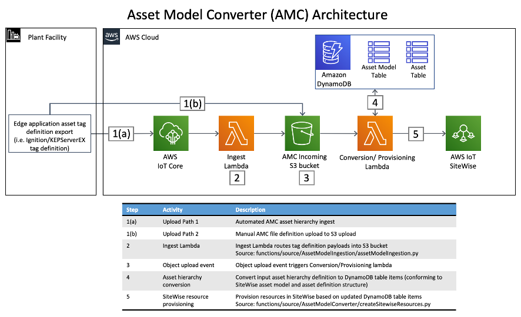

This Quick Start will deploy resources detailed in the architecture diagram below outlined in the dotted orange box.

Deploying this Quick Start for a new virtual private cloud (VPC) with
*default parameters* builds the following _{partner-product-name}_ environment in the AWS Cloud.

// Replace this example diagram with your own. Send us your source PowerPoint file. Be sure to follow our guidelines here : http://(we should include these points on our contributors giude)
//[#architecture1]
.Quick Start architecture for _{partner-product-name}_ on AWS
//[link=images/architecture_diagram.png]
//image::../images/architecture_diagram.png[Architecture,width=648,height=439]
image::../images/imc_reference_architecture.png[Architecture,width=648,height=439]

As shown in Figure 1, the Quick Start sets up the following:

. *AWS IoT Greengrass:* A Greengrass group is provisioned and deployed to the the edge gateway device (physical device or simulated with EC2 instance). This Greengrass group is configurable during cloudformation stack launch to include a SiteWise connector that will connect to the OPC UA server of the partner edge application (i.e. Igntiion Server or KEPServerEX). The Greengrass core deployed to the edge device can be configured to route data throug the SiteWise connector to AWS IoT SiteWise or via MQTT to AWS IoT Core's message broker.
. *AWS IoT Core:* AWS IoT Core can receive and route MQTT messages originatinng from both the partner edge software application (i.e. Ignition Server or KEPServerEX) or from the Greengrass core. These messages may conntain the telemetry values of the PLC tags generated by the edge devices (PLCs). In the case that the Cirrus Link Driver for the AMC is configured, AWS IoT Core routes messages containing the asset hierarchy (metadata) for tags defined within Ignition Server runnign at the edge to the AMC where they are mapped into the appropriate resources within AWS IoT SiteWise.
. *AWS IoT SiteWise:* This service maintains the industrial machine asset hierarchy information and contains a managed time series database to store all data generted by these industrial assets. It also inncludes a SaaS dashboard building service called Monitor. Monitor allows users to build custom dashboards for near real-time data visualization. The AMC maps asset hiearchy data (i.e. Plant/Line/Machine/Tag) into SiteWise automatically as part of the IMC cloudformation stack launch.
. *Kinesis to S3:* Amazon Kinesis Data Firehose routes data messages from AWS IoT Core into an S3 bucket where they are stored and made available for analysis by services like Amazon QuickSight.
. *QuickSight:* Amazon QuickSight enables users to build custom business intelligence dashboards and visualizations for data that is routed to and stored in the S3 datalake. The IMC kit provides a simple data ingest route to S3 by default. Users can easily adapt and extend this basic framework to suit their individual needs.
. *Asset Model Converter (AMC):* The AMC is a serverless workflow that ingests asset hierarchy definition files/messages generated by the partner edge applications and converts them into a schema compatible with AWS IoT SiteWise's asset model definition schema. The AMC automatically generates asset models within sitewise, creates unique assets from those models and then links all assets together in a well-defined hierarchy that mirrors the industrial assets at the customer facility (i.e. factory/lines/machines/tags). The AMC was designed to enable additional partner edge applications to be integrated with it with minimal effort. The AMC architecture diagram is shown in more detail below. 

.Asset Model Converter (AMC) architecture diagram
//[link=images/architecture_diagram.png]
//image::../images/architecture_diagram.png[Architecture,width=648,height=439]

