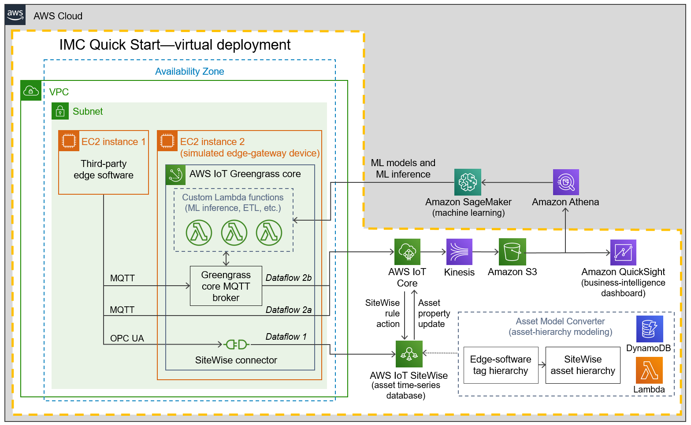
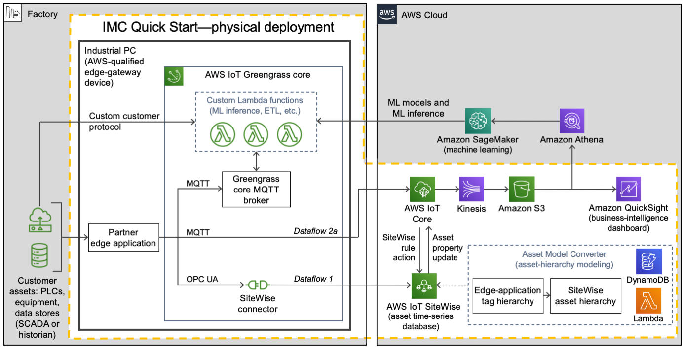
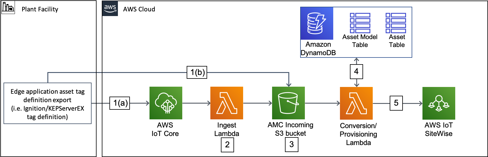

:xrefstyle: short

Deploying this Quick Start in virtual mode builds the following {partner-product-name} environment in the AWS Cloud. Elements of the Quick Start are outlined in the dotted orange box.

[#architecture-virtual]
.Architecture of the {partner-product-short-name} Quick Start—virtual deployment

As shown in <<architecture-virtual>>, the virtual deployment of the {partner-product-short-name} Quick Start sets up the following:

* A virtual private cloud (VPC) configured with a public subnet within a single Availability Zone. The {partner-product-short-name} Quick Start can be launched in the default VPC of your existing AWS infrastructure, or it can generate a new VPC.
* In the subnet:
** One EC2 instance for the partner edge application (such as Ignition or KEPServerEX).
** A second EC2 instance for the AWS IoT Greengrass core group. This instance simulates the edge-gateway device, an industrial PC. When you launch the Quick Start, you configure this core group for the dataflow option that suits your use case. (Dataflow options are also called ingestion patterns or edge-to-cloud paths.) These are the three dataflow options: 
*** Dataflow option 1 sends data from the AWS IoT SiteWise connector running in an AWS IoT Greengrass core. This path goes from the open platform communications (OPC) unified architecture (UA) server of the partner edge application to AWS IoT SiteWise.
*** Dataflow option 2a sends data directly to AWS IoT Core from edge applications, such as Ignition with the Cirrus Link MQTT module. 
*** Dataflow option 2b sends data from the edge application (such as Ignition or KEPServerEX) to the AWS IoT Greengrass core. There, customer-defined AWS Lambda functions process or filter the data and use it for local machine-learning (ML) model inference through Amazon SageMaker. Or the data may be consumed by a containerized Docker application. Raw and processed data can then be transmitted to the AWS Cloud through a number of paths, including AWS IoT Core, Amazon Kinesis Data Streams, or AWS IoT Analytics. These edge-processing capabilities are not part of the IMC Quick Start, so they aren't shown in the dotted orange box. You can add whichever components apply for your use case. 
* Asset Model Converter. The AMC is a serverless, module-based framework that uses Amazon S3 and Lambda to map edge-based asset-modeling software conventions onto AWS IoT SiteWise. When you launch the Quick Start, the AMC automatically maps data from the asset hierarchy (such as factory, lines, machines, tags) onto AWS IoT SiteWise models and assets. For details, see <<amc-architecture>>. 
* AWS IoT SiteWise. This service maintains the information on the asset hierarchy. It also contains a managed time-series database of all the data generated by the assets. It includes a SaaS dashboard-building service called Monitor. With Monitor, you can build custom dashboards for near-real-time data visualization. 
* AWS IoT Core. This service receives and routes MQTT messages originating either from the partner edge software application (such as Ignition or KEPServerEX) or from the AWS IoT Greengrass core. If the Cirrus Link driver for the AMC is configured, AWS IoT Core routes messages containing asset-hierarchy information.
* Amazon Kinesis Data Firehose. This service routes data messages from AWS IoT Core to an S3 bucket.
* Amazon S3. The manufacturing data is stored as an S3 data lake.
* Amazon Athena and Amazon QuickSight. You use these services to build custom business-intelligence dashboards and visualizations for data stored in the data lake.

Deploying this Quick Start in physical mode (in a factory), builds an environment like the one shown in <<architecture-physical>>. Elements of the Quick Start are outlined in the dotted orange box.

[#architecture-physical]
.Architecture of the {partner-product-short-name} Quick Start—physical deployment

Unlike the virtual deployment (<<architecture-virtual>>), the physical deployment (<<architecture-physical>>) has the AWS IoT Greengrass core running on an industrial PC in the customer's factory. The physical deployment uses the same resources as the virtual deployment with the following differences:

* In physical deployments, no EC2 instances are launched in the VPC. Instead, AWS IoT Greengrass is installed directly onto an industrial PC. It's installed by a bootstrap installation script that's part of the AWS CloudFormation stack launch.
* In physical deployments, edge applications (Ignition, KEPServerEX) communicate with PLCs, historians, databases, and other IoT devices running in the factory.  

For a zoomed-in view of the AMC, see <<amc-architecture>>.

[#amc-architecture]
[link=images/AMCArchitecture.png]
.Asset Model Converter (AMC) architecture diagram

The AMC architecture, shown in <<amc-architecture>>, has a serverless sequence flow. The AMC ingests asset-hierarchy-definition files or messages generated by the partner edge applications (such as Ignition or KEPServerEX) and converts them into a schema compatible with AWS IoT SiteWise. It then automatically provisions a matching asset hierarchy (such as factory, lines, machines, and tags) in AWS IoT SiteWise. With this automatic mapping, application builders have immediate access to the customer's asset hierarchy within a managed service (AWS IoT SiteWise) in the AWS Cloud. These application builders may be the customer's own developers, regional or global systems integrators, or an AWS ProServe team.
 
The AMC integrates additional partner edge applications with minimal effort.  

