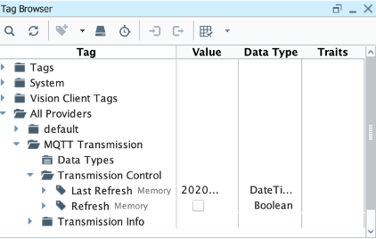
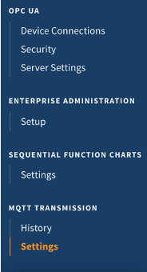
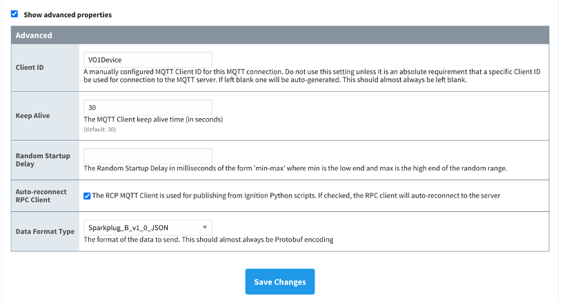
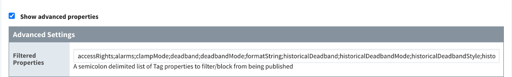

// Add any tips or answers to anticipated questions. This could include the following troubleshooting information. If you don't have any other Q&A to add, change "FAQ" to "Troubleshooting."

//
//faq_troubleshooting_virtual.adoc
//faq_troubleshooting_physical_greenfield.adoc
//faq_troubleshooting_physical_greenfield.adoc

:xrefstyle: short

== FAQ

*Q.* I encountered a *CREATE_FAILED* error when I launched the Quick Start.

*A.* If AWS CloudFormation fails to create the stack, relaunch the template with *Rollback on failure* set to *Disabled*. This setting is under *Advanced* in the AWS CloudFormation console on the *Configure stack options* page. With this setting, the stack's state is retained, and the instance keeps running so that you can troubleshoot the issue. (For Windows, look at the log files in `%ProgramFiles%\Amazon\EC2ConfigService` and `C:\cfn\log`.)
// If you're deploying on Linux instances, provide the location for log files on Linux, or omit this sentence.

WARNING: When you set *Rollback on failure* to *Disabled*, you continue to incur AWS charges for this stack. Delete the stack when you finish troubleshooting.

For more information, see https://docs.aws.amazon.com/AWSCloudFormation/latest/UserGuide/troubleshooting.html[Troubleshooting AWS CloudFormation^].

*Q.* I encountered a size-limitation error when I deployed the AWS CloudFormation templates.

*A.* Launch the Quick Start templates from the links in this guide or from another S3 bucket. If you deploy the templates from a local copy on your computer or from a location other than an S3 bucket, you might encounter template-size limitations. For more information, see http://docs.aws.amazon.com/AWSCloudFormation/latest/UserGuide/cloudformation-limits.html[AWS CloudFormation quotas^].

*Q.* Can I update a stack to a different deployment type (physical, virtual) or dataflow option (Option1, 2a, 2b)? 

*A.* Updates are not supported. To achieve a different deployment type or dataflow type, deploy a new stack. See the following question and answer for details on deploying more than one stack in an account. Then decide whether to delete your original stack before creating another.

*Q.* Can I deploy multiple times in the same AWS account? 

*A.* Yes, you may deploy multiple stacks in the same account. Be wary of the following: 

* For Option 1 deployments, AWS IoT SiteWise may receive data from multiple sources if, for example, two instances of Ignition are publishing data onto the topic `/Tag Providers/default/Line1/CNC/Temperature`.

* If AWS IoT SiteWise models and assets exist in the Cloud from a previous deployment, a new deployment does not recreate the model or asset hierarchy. Instead, the Asset Model Converter operates by recognizing any changes in the existing models or assets and the new deployment hierarchy. For example: 
** If the previously deployed hierarchy is identical to the newly deployed one, nothing in AWS IoT SiteWise is changed.
** If the newly deployed hierarchy has an identical structure to the previously deployed hierarchy with additional nodes that follow the hierarchy pattern, the new models or assets are created in AWS IoT SiteWise:
*** Previous:
 
 Line 1/CNC1/Temperature

*** New:

 Line 1/CNC1/Temperature
 Line 1/CNC2/Temperature

* If the newly deployed hierarchy has a different hierarchy than the previously deployed hierarchy altogether, the Asset Model Converter does not create the new models and assets.
* Refer to the instructions in the appendix showing how to add a line and device with tags to a project in Ignition using Ignition Designer.

*Q.* Does any hardening of the operating system occur during deployment? 

*A.* Yes. Fail2ban is installed and enabled on the device, which bans IPs that show the following malicious signs: 

* Too many password failures.
* Seeking exploits.
* Shared memory on the device is secured by `/etc/fstab`.

*Q.* Can I rerun the AMC to create new models and assets? 

*A.* Yes. Follow these steps:

. If any of the models or assets you want to create shares a name with the models or assets created in the first pass of the AMC execution, delete the models and assets in AWS IoT SiteWise.
. Clear out the following DynamoDB tables associated with the initial {partner-product-short-name} Quick Start deployment (replacing the information in brackets):
.. Table 1: `<stack-name>-asset-model-table`
.. Table 2: `<stack-name>-asset-table`

Depending on the AMC driver you used, take the follow actions to rerun the AMC: 

*AMC driver: IgnitionCirrusLink*

Initiate a rebirth (NBIRTH,DBIRTH) MQTT message that represents the your project hierarchy.

. Connect to your Ignition server in Ignition Designer.
. Launch Ignition Designer, open the tag browser, and choose *Tag providers*, *MQTT Transmission*, *Transmission Control*. 
. Choose the *Refresh* button. A birth message is initiated.

.Refresh Sparkplug Birth Certificates
[link=images/RefreshBirthCertificates.png]

.. This action initiates the {partner-product-short-name} Quick Start's AMC, which creates the models and assets that represent the Ignition hierarchy in AWS IoT SiteWise. 

*AMC driver: IgnitionFileExport*

. Obtain your JSON file that represents the new hierarchy and drop it into the following S3 bucket (replacing the information in brackets):

.. `<name_of_stack>-<amcincomingresource>-<hash>`

*AMC driver: KepServerFileExport*

. Obtain your JSON file that represents the new hierarchy and drop it into the following S3 bucket:
.. `<name_of_stack>-<amcincomingresource>-<hash>`

*Q.* How do I add a QuickSight visual?

*A.* You may create Amazon QuickSight visuals for the data that is put in the S3 bucket by the Kinesis Data Firehose. Before you create these visuals, complete the following prerequisite steps:

Prerequisites:

* Sign in to the AWS Management Console, and open the QuickSight service console.
** If you have not previously used QuickSight, you are prompted to grant access to QuickSight. See https://docs.aws.amazon.com/quicksight/latest/user/getting-started.html[Getting Started with Data Analysis in Amazon QuickSight^] for additional details.
* Create a QuickSight visual.
** The data source is the S3 bucket that receives data from the AWS IoT Core rule. The S3 bucket is named `<stack_name>-imcs3bucket-<hash>` (replacing the information in brackets).
** Open the Amazon QuickSight console home page, and choose *New analysis*, *New dataset*. Then choose the *Amazon S3* service icon. 
** Add details for the dataset:
** Data source name: Provide a name for the {partner-product-short-name} dataset, such as *IMC-QS-Dataset*.
*** Manifest file: Leave the *URL* radio button chosen for the *Upload a manifest file* text entry option, and paste the URL of the S3 bucket manifest file. The manifest file is located in the same S3 bucket where the data is stored (S3 bucket name: `<stack_name>-imcs3bucket-<hash>`). The manifest file is named `imcquicksightdata.json`. The S3 URL follows this naming convention: `https:// <stack_name>-imcs3bucket-<hash>.s3.amazonaws.com/imcquicksightdata.json`.

*Q.*
How do I add a QuickSight visual?

*A.*
You may create Amazon QuickSight visuals for the data that is put in the S3 bucket by the Kinesis Data Firehose. Before you create these visuals, complete the following prerequisite steps:

Prerequisites:

. Sign in to the AWS Management Console, and open the QuickSight service console.
.. If you have not previously used QuickSight, you are prompted to grant access to QuickSight. See https://docs.aws.amazon.com/quicksight/latest/user/getting-started.html[Getting Started with Data Analysis in Amazon QuickSight^] for additional details.
. Create a QuickSight visual.
.. The data source is the S3 bucket that receives data by the AWS IoT Core rule. The S3 bucket is named `<stack_name>-imcs3bucket-<hash>` (replacing the information in brackets).
.. Open the Amazon QuickSight console, and choose *New analysis*, *New dataset*. Choose the Amazon S3 service icon. 
.. Add details for the dataset:
... Data source name: Provide a name for the {partner-product-short-name} dataset, such as *IMC-QS-Dataset*.
... Manifest file: Leave the *URL* radio button chosen for the *Upload a manifest file* text entry option, and paste the URL of the S3 bucket manifest file. The manifest file is located in the same S3 bucket where the data is stored (S3 bucket name: `<stack_name>-imcs3bucket-<hash>`). 
... The manifest file is named `imcquicksightdata.json`. The URL follows this naming convention:
.... `https://<stack_name>-imcs3bucket-<hash>.s3.amazonaws.com/imcquicksightdata.json`

== Troubleshooting

*Quarantined certificate in Ignition doesn't show up (or data doesn't show up for dataflow option 1 deployments)*

First, verify that the Ignition trial period (2 hours) has not expired. If that action does not remediate the issue, repeat the process of refreshing the AWS IoT SiteWise gateway:

. Open the AWS IoT SiteWise console, and choose *Ingest*, *Gateways*. 
. Choose the gateway created during the stack launch (replacing the information in brackets):
.. Naming convention: `<name_of_stack>_Automated_Gateway`
. In the *Source Configuration for Automated Gateway Config* section, choose *Edit*.
. Choose *Save* at the bottom. No changes are necessary. This action activates the AWS IoT SiteWise gateway to make sure that data flows from the OPC UA server. 
. If it hasn't already been done, navigate to Ignition, and look for and accept the quarantined certificate.

* If using KepServer for Windows, make sure that your default firewalls have been turned off. They prevent the AWS IoT SiteWise gateway certificates from showing up.

*Can't access Ignition web UI*

Ensure that you're attempting to connect from the same network you defined as your public IP while setting up the stack. If you're attempting from a different network, edit the security group associated with the two EC2 instances. (It's the same security group.)

. Open the EC2 console.
. Highlight one of the two EC2 instances that has been created for your deployment.
. Scroll to the right and choose the security group associated with the EC2 instance.
. Edit the inbound rules for the rule associated with port 8088 to match the IP address you're attempting the connection from. 

*Narrowing Ignition or AWS IoT Greengrass permissions (for workload template deployments only)*

. Open the EC2 console.
. Take note of the private IP addresses of the following:
.. The AWS IoT Greengrass EC2 instance for the current deployment
.. The Ignition EC2 instance for the current deployment
. Highlight one of the two EC2 instances that has been created for your deployment.
. Scroll to the right and choose the security group associated with the EC2 instance.
. Edit the rule associated with port 8883 and replace *0.0.0.0/0* with the private IP address for the Ignition EC2 instance.
. Edit the rule associated with port 62541 and replace *0.0.0.0/0* with the private IP address for the AWS IoT Greengrass EC2 instance.

*Models and assets weren't created in AWS IoT SiteWise*

If models and assets were not created in AWS IoT SiteWise and the Cirrus Link AMC driver was used, follow these steps to troubleshoot.

. Open the Ignition console, and navigate to MQTT transmission settings.

.Ignition—Settings
[link=images/IgnitionSettings.png]

[start=2]
. Choose *Servers*, *Settings*, *Edit*. 
. At the bottom of the screen, select the *Show advanced properties* check box.
. Under *Data Format Type*, choose *Sparkplug_B_v1_0_JSON*. 
. Choose *Save Changes*.

.Ignition—MQTT transmission module settings
[link=images/Ignition-MQTT-Settings.png]

[start=6]
. Verify that `tagPathConfiguration` is not being filtered out:
.. In the MQTT transmission module settings, choose *Transmitters*, *Edit*. 
.. At the bottom of the screen, select the *Show advanced properties* check box. 
.. Verify that `tagPathConfiguration` is not being filtered out. 

[#ignition-mqtt-filtered]
.Ignition—MQTT transmission module filtered properties
[link=images/Ignition-MQTT-Filtered-Properties.png]

If these settings are as shown in <<ignition-mqtt-filtered>> and you're still receiving errors, check the Lambda function responsible for creating the models and assets in AWS IoT SiteWise for errors:

. Open the AWS Lambda console, and navigate to the function with this name (replacing the information in brackets):
    `<name_of_stack>-AssetModelIngestionLambdaResource-<hash>`
. Choose the *Monitoring* tab.
. Choose *View logs in CloudWatch*.
. Click into the most recent log stream, and find the error message to troubleshoot.

*Data from the MQTT transmission module doesn't show up in the IoT cloud*

. Get the public IP address of that instance, and load a URL like this into any browser (replacing the information in brackets):

 http://<hardwarePrivateIP>:8088

. Open the Ignition web UI. Choose the gear-like icon on the left labeled *Config*. When prompted, log in. If you haven't already changed your password, do so after you've logged in. These are the default credentials:
* User name: admin
* Password: password (default password)
. Choose *MQTT Transmission*, *Settings*, *Server*. Confirm that the connectivity shows 1 of 1. If it doesn't, choose *Edit* and do the following:
.. Make sure that the URL is in the format: `ssl://<your_aws_account_iot_endpoint>:8883`
.. Download the .tar.gz` file that represents the non-GreenGrass IoT thing from the following S3 bucket location (replacing the information in brackets):
... Bucket name: `<stack_name>-devicesbucketresource-<hash>`
... Key name: `<name_for_edge_device_parameter>/<name_for_edge_device_parameter>Device.tar.gz`
.. Expand the tarball.
.. Replace the CA certificate file with `root.ca.pem` from the tarball package.
.. Replace the client certificate file with the `.pem` file from the tarball package.
.. Replace the client private key file with the `.private` file from the tarball package.
.. Choose *Save Changes*, and make sure that the connectivity says *1 of 1*.
