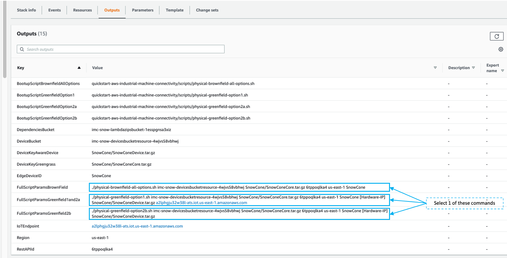

// This doc is for the "Post deployment steps section"
// Current URL: https://aws-quickstart.github.io/quickstart-aws-industrial-machine-connectivity/#_post_deployment_steps

=== Post-Deployment Steps
Stack deployment will take approximately 10 minutes. You can track the progress of the stack launch by viewing the “Events” tab of the CloudFormation stack console. Once the CloudFormation stack is completed, follow the steps to configure the IMC Quick Start to make it operational. The Post-Deployment steps include the following sections:

. <<Edge Devices (Physical Deployments Only)>>
. <<Edge Software Deployment (Physical Deployments Only)>>
. <<Asset Model Convertner (AMC) Initiation>>
. <<SiteWise Connector Activation>>
. <<Validate Incoming Data>>

==== Edge Devices (Physical Deployments Only)
The physical brownfield deployment is intended to demonstrate the capabilities of the IMC Quick Start in an environment where the end user has an existing edge-based asset modeling software (such as Ignition or KepServer). It is deployed onto physical hardware. After deployment, the physical hardware will run Greengrass software and connect into the edge-based asset modeling software. The IMC Quick Start supports the following OEM devices: 

* Lenovo
** Model: ThinkCentre M90n IoT
** Architecture: Intel® Celeron® 4205U (x86)
** URL: https://www.lenovo.com/us/en/desktops-and-all-in-ones/thinkcentre/m-series-tiny/ThinkCentre-M90n-IoT/p/thinkcentre-m90n-iot
* ADLINK 
** Model: MXE-211
** Architecture: Intel Atom® Processor E3900 (x86) 
** https://www.adlinktech.com/Products/Industrial_IoT_and_Cloud_solutions/IoTGateway/MXE-210_Series?lang=en
* OnLogic
** Model: Karbon 300 Compact Rugged Computer
** Architecture: Intel Atom® E3930 or E3950 processors
** URL: https://onlogic.com/k300/ 
* Advantech 
** Model: UNO-2372G
** Architecture: Intel Atom E3845/Celeron® J1900 Quad-Core Processors
** URL: https://www.advantech.com/products/1-2mlj9a/uno-2372g/mod_f4ff5680-f016-44bd-bff0-e5eddfd82237
* MOXA
** Model: MC-1112-E4-T
** Architecture: Intel Atom® Processor E3845 processor
** URL: https://www.moxa.com/en/products/industrial-computing/x86-computers/mc-1100-series/mc-1121-e4-t

==== Edge Software Deployment (Physical Deployments Only)
NOTE: This step is only necessary if deploying one of the physical deployment options (Physical-Greenfield/Physical-Brownfield)

NOTE: You must have the AWS CLI configured to point to the AWS account you’re using for the IMC Quick Start.

NOTE: The Physical-Brownfield deployment mode does not come with a configured set of project tags similar to the virtual deployment but does come with a set of device simulations that can be configured to represent a project tag structure similar to the virtual deployment tag structure (or your own structure entirely). This deployment can be configured to work with a physical PLC test harness. 

NOTE: The Physical-Greenfield deployment mode is compatible with either Inductive Automation’s Ignition Server (https://inductiveautomation.com/ignition/) or PTCs KEPServerEX (https://www.kepware.com/en-us/products/kepserverex/). This deployment option does not bootstrap any partner edge software. The only edge software application that is bootstrapped on the physical hardware as part of the deployment is AWS IoT Greengrass.

===== Retrive the IMC Edge Device Bootup Script
. Retrieve and run the bootup script for the physical hardware device
.. Open a terminal on the physical hardware
.. Use the command line to become the root user in your terminal session: 
 
 sudo su

.. Ensure you are in the `home/ubuntu` directory
.. Use the command line to retrieve the deployment script from your stack’s S3 bucket. Before running this commmand, ensure you have the AWS CLI configured in the region where you are launching the IMC Quick Start CloudFormation stack.
.. In your home directory run this command to get the physical deployment bootup script from an S3 bucket:

 aws s3api get-object --bucket [DependenciesBucket] --key [BootupScript]

To get the values of the 2 options:

- [DependenciesBucket]
- [BootupScript]

Open the CloudFormation service console, open the *NESTED* IMC Quick Start CloudFormation stack, select the *Outputs* tab and follow the instructions below:

[cols="2,2a"]
.Options
|===
|*Key*
|*Value*

|[DependenciesBucket] 
|Dependecies Bucket Name *_(see green text below for reference)_*

|[BootupScript] 
| Find key corresponding to your configuration:

* <<pre-reqs.adoc#BootupScriptGreenfieldOption1,BootupScriptGreenfieldOption1>>
* <<pre-reqs.adoc#BootupScriptGreenfieldOption2a,BootupScriptGreenfieldOption2a>>
* <<pre-reqs.adoc#BootupScriptGreenfieldOption2b,BootupScriptGreenfieldOption2b>>
* <<pre-reqs.adoc#BootupScriptBrownfieldAllOptions,BootupScriptBrownfieldAllOptions>>	 

and select its value *_(see blue text below for reference)_*
|===

.[DependenciesBucket] and [BootupScript]
//[link=images/architecture_diagram.png]
//image::../images/architecture_diagram.png[Architecture,width=648,height=439]
image::../images/DependenciesBucket.png[Architecture,width=648,height=439]

===== Execute the IMC Edge Device Bootup Script

. Use the command line to make the file executable: 
  
  chmod +x [bootupSctipt].sh

.. `[bootupScript]` was fetched in the previous step using `aws s3api get-object` CLI command described above.

. Open the CloudFormation service console, open the *NESTED* IMC Quick Start CloudFormation stack, select the *Outputs* tab and copy the bootup CLI command from the *Value* of the Key:Value pairs below:

[cols="2,2a"]
.Options
|===
|*Key*
|*Value*

| FullScriptParamsGreenfield1and2a
| Copy the command from the CloudFormation *Value* column

* This option is for: deployment type = <<pre-reqs.adoc#Physical-Greenfield,Physical-Greenfield>>, data flow option = <<pre-reqs.adoc#Option 1 (OPC-UA to SiteWise),Option 1 (OPC-UA to SiteWise)>> or <<pre-reqs.adoc#Option 2a (MQTT to IoT Core),Option 2a (MQTT to IoT Core)>>

| FullScriptParamsGreenfield2b
| Copy the command from the CloudFormation *Value* column

* This option is for: deployment type = <<pre-reqs.adoc#Physical-Greenfield,Physical-Greenfield>>, data flow option = <<pre-reqs.adoc#Option 2b (MQTT to Greengrass to IoT Core),Option 2b (MQTT to Greengrass to IoT Core)>>	 

| FullScriptParamsBrownField
| Copy the command from the CloudFormation *Value* column

* This option is for: deployment type = <<pre-reqs.adoc#Physical-Brownfield,Physical-Brownfield>>, data flow option = <<pre-reqs.adoc#Option 1 (OPC-UA to SiteWise),Option 1 (OPC-UA to SiteWise)>> or <<pre-reqs.adoc#Option 2a (MQTT to IoT Core),Option 2a (MQTT to IoT Core)>> or <<pre-reqs.adoc#Option 2b (MQTT to Greengrass to IoT Core),Option 2b (MQTT to Greengrass to IoT Core)>> 

|===

.Physical Deployment Bootup Scripts
//[link=images/architecture_diagram.png]
//image::../images/architecture_diagram.png[Architecture,width=648,height=439]

- In the command string, replace `[HardwareIP]` with the physical device’s private IP address

- Use the command line to run the deployment script, which should resemble something like the following (but filled in with your stack-specific values):
 
 ./physical-greenfield-option1.sh imc-snow-devicesbucketresource-4wjvs58vbhwj SnowCone/SnowConeCore.tar.gz 6tppoqlka4 us-east-1 SnowCone [Hardware-IP] SnowCone/SnowConeDevice.tar.gz [IoT Core ATS Endpoint]

==== Create Tag Hierarchy in Ignition (Physical Greenfield Only)
Represent your data in Ignition by creating a project tag hierarchy. The source of this data can be physical PLCs, or simulated devices in Ignition. 

. Download the Ignition Designer software
. In your browser of choice, visit the following URL: 

 http://[hardwarePrivateIP]:8088

. On the top right corner of the screen, click “Get Designer”
. Install the Ignition Designer for your operating system
. Open the Ignition Designer and connect to your Ignition server
. Launch the Designer
.. Click “Add Designer” 
.. Click “Manually Add Gateway”
.. Add a Gateway URL in the following format: 

 http://[reachableIgnitionIP]:8088

.. Under the Gateway tile you just added, click “Launch” 
. Supply the username and password and click “Login”
.. Username: admin
.. Password: password
... If you haven’t already, it is recommended that you change your password once you’ve successfully logged into the Ignition web UI.
. With the help of an OT professional or IMC Quick Start contact, represent your PLC data (simulated or real) in a hierarchy

==== Trigger an Sparkplug node “birth” message in Ignition

. Once you are logged in to the Ignition Designer, a birth message is triggered by navigating to the tag browser, opening `tag providers`, selecting `MQTT Transmission`, then selecting `Transmission Control` and clicking the “Refresh” button.

.Refresh Sparkplug Birth Certificates
//[link=images/architecture_diagram.png]
//image::../images/architecture_diagram.png[Architecture,width=648,height=439]
image::../images/RefreshBirthCertificates.png[Architecture,width=648,height=439]

This action triggers the IMC Quick Start’s asset model converter (AMC), which creates the models and assets that represent the Ignition hierarchy in SiteWise. 

==== Accept the OPC UA Client Certificate
To enable the SiteWise to ingest data over OPC UA from Ignition’s OPC UA server, you must accept the certificate presented by the SiteWise connector within Ignition.

. Get the private IP address of the physical hardware, and load a URL like this into your browser of choice: http://[hardwarePrivateIP]:8088
. Once the Ignition Web UI is open, you should see a gear like icon on the left labeled `Config`. 
. Click that, and it may ask you to log in. The default credentials are:
.. Username: admin
.. Password: password
.. If you haven’t already, it is recommended that you change your password once you’ve successfully logged into the Ignition web UI.
. Navigate to "OPC UA -> Security -> Server" and wait for the quarantined certificate to appear (from AWS IoT SiteWise Gateway). You should see a single entry under 'Quarantined Certificates' named something like 'AWS IoT SiteWise Gateway Client'.
. Click “Trust” to accept the certificate. At this point, the SiteWise connector will start consuming data over OPC UA from Ignition and this data will be sent up to the AWS IoT SiteWise in the cloud.

==== Asset Model Convertner (AMC) Initiation
Select the Asset Model Connverter (AMC) Driver you configured in the CloudFormation stack configuration (CF stack parameter label: `AMCDriver`) to follow the appropriate post-deployment steps:

* <<AMCDriver - IgnitionCirrusLink>>
* <<AMCDriver - IgnitionFileExport>>

===== AMCDriver - IgnitionCirrusLink
This AMCDriver option runs automatically with the launch of the IMC Quick Start (Virtual Option). Proceed to the next section: <<SiteWise Connector Activation>>

===== AMCDriver - IgnitionFileExport
In this section you will export the JSON file from Ignition Server that describes your project's tag hierarchy and upload it into an S3 bucket (created during CF stack formation) to initiate the AMC workflow.

. Access the Ignition Server Web App
.. Open the Ignition Server UI by clicking the URL available in the output of the CloudFormation stack. The format of the URL is:
... http://<IginitionServerPublicIP>:8088
.. The IgnitionServerPublicIP address is the same as the public IP address of the EC2 instance on which Ignition Server is running. The name of the EC2 instance should end with ‘/Ignition’ 
.. Reminder: The security group of this EC2 instance is opening up the 8088 port to IP addresses in a specific CIDR block based on the “public IP address” parameter you entered during the CloudFormation stack launch.

. Get the Ignition Designer Launcher Software
.. Once the Ignition Web UI is open, click “sign in” in the top right corner and login with the default credentials:
.. Username: admin
.. Password: password
... It is recommended that you update the username and password from the default values immediately after login.
.. On the top right corner of the screen, click “Get Designer”
.. Follow the instructions to install the Ignition Designer software application for your local machine’s operating system

. Add Ignition Gateway
.. Open the Ignition Designer Launcher application
.. Click “Add Designer” 
.. Click “Manually Add Gateway”
.. Add a Gateway URL in the following format: 
... http://[ignition_ec2_public_ip]:8088

. Export tag definition JSON file
.. In the Ignition Designer Launcher app, under the gateway tile you just added, click “Launch” 
.. Supply the username and password (defined previously) and click “Login”
.. In the Tag Browser, under “Tag Providers” select “default” and click export. Save this tag definition JSON file in local location you can access.

.Export Tags from Ignition
//[link=images/architecture_diagram.png]
//image::../images/architecture_diagram.png[Architecture,width=648,height=439]
image::../images/IgnitionExportTags.png[Architecture,width=648,height=439]

. Initiate the Asset Model Converter (AMC)
.. Upload the JSON file you just downloaded into the S3 bucket created during deployment to trigger the AMC and creation of models and assets in SiteWise. The S3 bucket will be named according to this convention:
... [name_of_stack]-[amcincomingresource]-[hash]
.. Upon uploading the JSON file into this S3 bucket, an S3 event trigger will automatically invoke the AMC Lambda function to begin the automated AMC workflow.
.. After approximately a minute (This may be longer (i.e. >5 minutes) for large, complex tag hiearchy definitions) models and assets will be provisioned within AWS IoT SiteWise.

The AMC workflow is now complete. Proceed to the next section: <<SiteWise Connector Activation>>

==== SiteWise Connector Activation
To enable the SiteWise connector running in AWS IoT Greengrass to ingest data over OPC UA from Ignition’s OPC UA server, you must accept the certificate presented by the SiteWise connector within Ignition.

. Accept SiteWise Certificate in Ignition
.. Open the Ignition Server UI using the URL available in the output of the CloudFormation stack. The format of the URL is: 
... http://[IginitionServer-EC2-Instance-PublicIP]:8088
... The IgnitionServerPublicIP address is the same as the public IP address of the EC2 instance on which Ignition Server is running. The name of the EC2 instance should end with ‘/Ignition’
... Reminder: The security group of this EC2 instance is opening up the 8088 port to IP addresses in a specific CIDR block based on the “public IP address” parameter you entered during the CloudFormation stack launch.
.. With the Ignition Web UI open, click “sign in” in the top right corner and login with the default credentials:
... Username: admin
... Password: password
.... It is recommended that you update the username and password from the default values immediately after login.
.. On the left side of the Ignition Web app UI, navigate to "OPC UA" -> "Security" -> "Server". The certificate from the SiteWise connector in Greengrass should appear int he "Quarantined Certificates" section. The certificate will have the name similar to: "AWS IoT SiteWise Gateway Client".
.. Click “Trust” to accept the certificate. At this point, the SiteWise connector will start consuming data over OPC UA from Ignition and this data will be sent up to the AWS IoT SiteWise service in the AWS cloud.

. Update the SiteWise Gateway
.. Navigate to AWS IoT SiteWise console and in the left-hand menu select "Ingest" -> "Gateways"
.. Select the gateway created during the stack launch. The gatweway name will follow the naming convention: 
... [name_of_stack]_Automated_Gateway
.. Click “Edit” in the Source Configuration for Automated Gateway Config” section
.. Click “Save” at the bottom. You do not need to make any changes. The action of editing and saving the configuration refreshes the SiteWise gateway and ensures data flows from the OPC UA server through the SiteWise gateway connector and into the AWS IoT SiteWise service in the AWS cloud.

==== Validate Incoming Data 

===== Data Flow Option 1
When using Data Flow Option 1, verify data flowing into AWS IoT SiteWise
. Now that you've trusted the SiteWise gateway connector certificate, return to the AWS IoT SiteWise console.
. In the SiteWise console, click the menu icon on the left-hand side of the page and select "build" -> "assets"
. In the asset tree on the left, drill down to an asset (i.e. Hauloff or Conveyor), select it and then select the “Measurements” tab for that asset.
. Verify that the values in the “Latest value” column are updating. This indicates that the Ignition simulation of those virtual devices and sensors is properly sending data through to the SiteWise connector (via OPC UA) in Greengrass and up to AWS IoT SiteWise in the AWS cloud.

===== Data Flow Option 2a or 2b
When using Data Flow Option 2a or 2b, validate data flow:

Validate data flow into AWS IoT Core:

. Navigate to the AWS IoT Core console.
. Select “Test” from the navbar on the left.
. Subscribe to the MQTT topic: 

 spBv1.0/AWS Smart Factory/DDATA/#

. Verify that messages are coming in on this topic.

Validate data flow into S3:

. Navigate to the S3 console.
. Search for the bucket: “[stack_name_here]-imcs3bucket-[hash]
. Click into the bucket and confirm that an S3 prefix inside the bucket named `mqtt` exists. 

==== View SiteWise Portal Data 

NOTE: SSO must be enabled in the region your launched in the CloudFormation stack in and you must have a user created in that region in order to access the SiteWise Monitor dashboards in the following sections.

. Log in to SiteWise Monitor Portal
.. Navigate to the SiteWise console, select the icon on the left and select "Monitor" -> "Portals". 
.. Select the hyperlinked "name" of the Portal most recently added (the topmost on the list). 
.. Add yourself as an administrator of the Portal by clicking “Assign Users” in the Portal Administrators section
.. Once you are listed as a Portal Administrator, click the hyperlinked URL in the Portal details section under the “URL” column. This URL should have the format: 

 https://[XXXXX....XXXXXX].app.iotsitewise.aws. 

.. Log in with the credentials (username and password) you just created for your administrator account.

. View Data in SiteWise Monitor Portal
.. Select “Dashboards” tab on the left-hand side, then select the newly created dashboard hyperlink under the “Name” column of the Dashboards page.
.. Data should be flowing into the line charts for the asset measurement properties
.. You can also see data for individual assets by navigating to the “Asset Library” tab on the left and selecting an asset from the asset tree. Once an asset is selected, you can view its properties.

==== Troubleshooting

===== Issue 1: Quarantined certificate in Ignition (or Kepware) doesn't show up, or data doesn’t show up for Option 1 deployments

Solution: 

First, verify that the Ignition trial period (2 hours) has not expired. If that action does not remediate the issue, repeat the process of refreshing the SiteWise Gateway:

. Navigate to the AWS IoT SiteWise console and select Ingest -> Gateways 
. Select the gateway created during the stack launch:
.. Naming convention: [name_of_stack]_Automated_Gateway
. Click “Edit” in the Source Configuration for Automated Gateway Config section
. Click “Save” at the bottom. No changes are necessary. This action simply activates the SiteWise gateway to ensure data flows from the OPC UA server. 
. If it hasn’t already been done, look for and accept the quarantined certificate in Ignition.

===== Issue 2: Models and assets weren’t created in SiteWise
Check the Lambda function responsible for creating the models and assets in SiteWise for errors:

. In the AWS lambda console, navigate to the function named:

 [name_of_stack]-AssetModelIngestionLambdaResource-[hash]

. Hit the “Monitoring” tab
. Click “View logs in CloudWatch”
. Click into the most recent Log Stream and find the error message

===== Issue 3: Models and assets weren’t created in SiteWise

Check the Lambda function responsible for creating the models and assets in SiteWise for errors:

. In the AWS lambda console, navigate to the function named 
 
 [name_of_stack]-AssetModelIngestionLambdaResource-[hash]

. Hit the “Monitoring” tab
. Click “View logs in CloudWatch”
. Click into the most recent Log Stream and find the error message

===== Issue 4: Data via the MQTT Transmission module doesn’t show up in IoT Cloud 

. Get the public IP address of that instance, and load a URL like this into your browser of choice:

 http://[hardwarePrivateIP]:8088

. Open the Ignition Web UI is open, you should see a gear like icon on the left labeled ‘Config’. Click that, and it will ask you to log in. The default credentials are: 
.. Username: admin
.. Password: password
.. If you haven’t already, it is recommended that you change your password once you’ve successfully logged into the Ignition web UI.
. Navigate to “MQTT Transmission -> Settings -> Server” and confirm that the connectivity shows 1 of 1. If it doesn’t, click edit and:
.. Make sure the URL is in the format: `ssl://[your_aws_account_iot_endpoint]:8883`
.. Download the .tar.gz file that represents the non-GreenGrass IoT thing from the following S3 bucket location:
... Bucket Name: `[stack_name]-devicesbucketresource-hash`
... Key Name: `[name_for_edge_device_parameter]/[name_for_edge_device_parameter]Device.tar.gz`
.. Expand the tarball
.. Replace the CA Certificate File with “root.ca.pem” from the tarball package
.. Replace the Client Certificate File with the “.pem” file from the tarball package
.. Replace the Client Private Key File with the “.private” file from the tarball package
.. Hit “Save Changes”, and make sure that the connectivity says “1 of 1”.

=== CloudFormation Stack Cleanup

Follow these steps to clean up the IMC CloudFormation stack deployment:

==== Cloud Asset Cleanup

. Navigate to the CloudFormation console and delete the base stack (not the stack named "NESTED"), in order to clean up the account as much as possible. Most of the resources will be deleted, but the stack deletion will fail due to non-empty S3 buckets and potentially a deployed Greengrass group (for all Virtual options by default, and for all Physical deployments that have been completed on a piece of hardware. The steps required to delete a stack are:
.. Empty the S3 buckets:
.. Navigate to the S3 service in the AWS Console.
.. In the search bar, enter your stack name.
.. For each bucket that is associated with the stack, select the bucket and click “Empty” under the search bar. The bucket naming convention is: 

 [name_of_stack]-[bucket_identifier]-[unique hash]

.. Here are the following `[bucket_identifiers]` that exist for each deployment:
... amcincomingresource
... amcoutputresource
... devicesbucketresource
... imcs3bucket
... lambdazipsbucket
. Force a reset of the GreenGrass group:
.. Navigate to the GreenGrass console
.. Select the GreenGrass group with the “Name for the Edge device” parameter name provided to the stack 
.. Under “Actions”, select “Reset Deployments”
.. Check the box that asks if you want to force the reset
.. Click “Reset Deployment”
. Navigate back to the CloudFormation console and once again delete the base stack. 
.. There is a master and nested stack. you must delete the master stack (the one that does not have “NESTED” in a gray box associated with it.
. Other resources to clean up after stack deletion (if desired, for cleanliness): SiteWise Portal, SiteWise Gateway, SiteWise Models and Assets, QuickSight dataset.

==== Edge Hardware Cleanup

. Navigate to a terminal on the edge hardware. Become the root user using the “sudo su” command.
. Stop and remove Ignition from hardware (Not applicable for Physical-Brownfield deployments): 

 cd /[path_to_Ignition_download]/Ignition-AWS-Kit-MQTT-v4
 ./remove.sh
 cd ..
 rm device.tar.gz group.tar.gz opcclient.der Ignition-AWS-Kit-MQTT-v4.zip physical-greenfield-option<insert_option_here>.sh
 rm -rf Ignition-AWS-Kit-MQTT-v4 

. Stop and remove GreenGrass:

 apt remove aws-iot-greengrass-core 
 rm -rf /greengrass
 rm -rf /var/sitewise