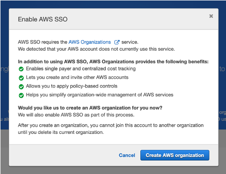
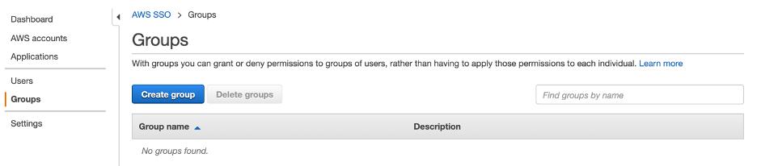
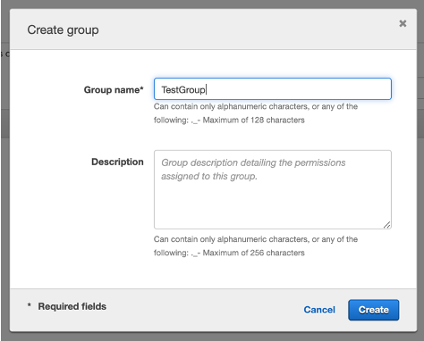
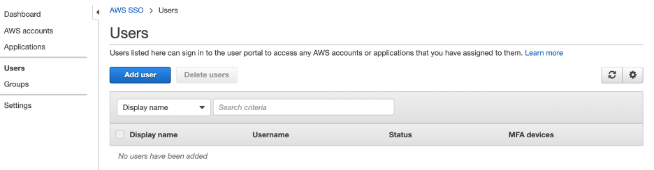
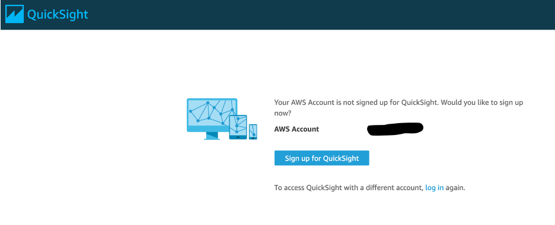
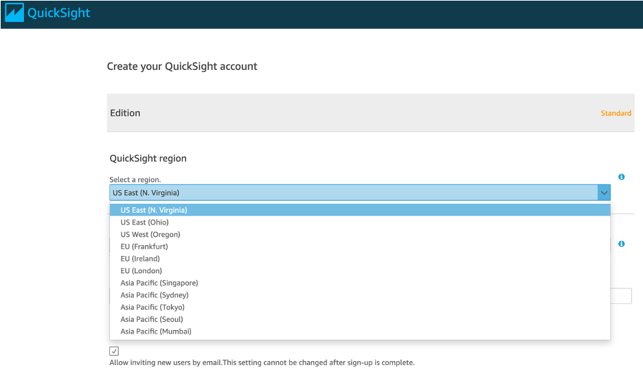

// If no preperation is required, remove all content from here

//==== Prepare your AWS account

//_Describe any setup required in the AWS account prior to template launch_

//==== Prepare your {partner-company-name} account

//_Describe any setup required in the partner portal/account prior to template launch_

== Prepare for the deployment

=== Deployment Configurations

The IMC Quick Start has 3 categories of deployment configurations:

. Deployment Type: 
.. <<Virtual>>
.. Physical
... <<Physical-Greenfield>>
... <<Physical-Brownfield>>
. Data Flow Option
.. <<Option 1 (OPC-UA to SiteWise)>>
.. <<Option 2a (MQTT to IoT Core)>>
.. <<Option 2b (MQTT to Greengrass to IoT Core)>>
. AMC Driver 
.. <<IgnitionCirrusLink>>
.. <<IgnitionFileExport>>
.. <<KepwareFileExport>>

==== Virtual

The virtual deployment is intended for demonstration, training and evaluation of the IMC Quick Start’s capabilities. EC2 instances will be launched to simulate edge gateway hardware but in all other aspects the experience will mirror that of the real physical deployment. This deployment mode relies on simulated tag values generated by the partner edge software. There are no physical PLCs or sensors that are being connected.

==== Physical

Physical deployment of the IMC Quick Start enables users to deploy edge software (i.e. AWS IoT Greengrass and partner edge software) on physical industrial PCs that are ready to connect to physical devices (I.e. PLCs)/historians/SCADA systems on the customers plant floor. The physical deployment has two flavors:

===== Physical-Greenfield

* AWS IoT Greengrass and the partner edge software will be running on a single industrial PC with Ignition Server installed alongside Greengrass on the same edge device.

===== Physical-Brownfield

* AWS IoT Greengrass will run standalone on an industrial PC and will connect to partner edge software application that is already running on the customers premises (i.e. on a VM in the server room of a manufacturing plant). We assume our access to the hardware is limited or non-existent, and our ability to reconfigure the Edge Software Application Server is limited to additive changes only.

The type of deployment (Virtual or Physical) determines whether to use physical edge hardware (Physical industrial PCs) or virtual edge hardware (EC2) and how connectivity and security is configured. All other cloud-based resources are largely the same.

==== Data flow options

In addition to the Virtual/Physical edge hardware distinction, the IMC Quick Start supports three types of data flow architectures. Each type outlines different methods of data ingestion from the edge environment into the AWS Cloud. 

===== Option 1 (OPC-UA to SiteWise)

In this variant, we have the AWS Greengrass SiteWise Connector configured to connect to the Edge Software Application OPCUA Server. All telemetry data will flow directly into AWS IoT SiteWise.

===== Option 2a (MQTT to IoT Core)

In this variant, the Edge Software Application Server has some kind functionality to connect to IoT Core via MQTT. All telemetry data is pushed from the Edge Software Application Server to AWS IoT Core, and from there usually pushed to S3 or a similar data lake for processing. 

NOTE: In Option 2a, data is not forwarded to AWS IoT SiteWise. Custom development is required to populate data in AWS IoT SiteWise.

===== Option 2b (MQTT to Greengrass to IoT Core)

This variant is almost identical to previous one (option 2a), except we instead have the Edge Software Application Server pushing MQTT data messages to the Greengrass Core first, and then those messages are forwarded on to AWS IoT Core.

NOTE: In Option 2a, data is not forwarded to AWS IoT SiteWise. Custom development is required to populate data in AWS IoT SiteWise.

==== AMC Driver Options
The Asset Model Converter (AMC) driver determines which edge software application the IMC Quick Start will be connecting to SiteWise. There are 3 AMC driver options to select from listed below:

===== IgnitionCirrusLink
This AMC driver uses the Cirrus Link Transmission Module running on Ignition Server to publish BIRTH certificates for all devices defineid with Ignition Server's tag database. This module follows the Sparkplug version B specification for MQTT. This AMC driver runs automatically during the IMC Quick Start deployment, so SiteWise resources are created automatically when the IMC Quick Start is deployed.

* In the CloudFormation stack *AMCDriver* parameter, you will select "IgnitionCirrusLink"

===== IgnitionFileExport
This AMC driver uses the manual tag definition file export mechanism within Ignition Server. With this AMC driver option, during the post deployment steps, users will manually export the tag definition file and upload it to an S3 bucket to initiatve the AMC process. 

* In the CloudFormation stack *AMCDriver* parameter, you will select "IgnitionFileExport"

===== KepwareFileExport
This AMC driver uses the manual tag definition file export mechanism within Kepware. With this AMC driver option, during the post deployment steps, users will manually export the tag definition file and upload it to an S3 bucket to initiatve the AMC process. 

* In the CloudFormation stack *AMCDriver* parameter, you will select "KepwareFileExport"

//Describe the enumerated deployment configurations
To deploy the IMC Quick Start, the user must consider the 3 deployment dimensions described above:

* *Deployment Type:* Virtual/Physical
* *Data Flow Options:* Option1, Option2a, Option2b
* *AMC Driver:* IgnitionCirrusLink, IgnitionFileExport, KepwareFileExport

==== Physical Deployment Configurations
There are specific resources you will need for the Physical Deployment post-deployment steps and are listed below. These are the bootup script names used for the 4 different types of physical deployments. Choose the one that corresponds to the deployment configuraiton you chose during the CloudFormation stack launch.

===== BootupScriptGreenfieldOption1 
* Description: Deployment Type = <<Physical-Greenfield>>, Data Flow Option = <<Option 1 (OPC-UA to SiteWise)>>

===== BootupScriptGreenfieldOption2a
* Description: Deployment Type = <<Physical-Greenfield>>, Data Flow Option = <<Option 2a (MQTT to IoT Core)>>

===== BootupScriptGreenfieldOption2b
* Description: Deployment Type = <<Physical-Greenfield>>, Data Flow Option = <<Option 2b (MQTT to Greengrass to IoT Core)>>

===== BootupScriptBrownfieldAllOptions
* Description: Deployment Type = <<Physical-Brownfield>>, Data Flow Option = ANY (<<Option 1 (OPC-UA to SiteWise)>>, <<Option 2a (MQTT to IoT Core)>>, <<Option 2b (MQTT to Greengrass to IoT Core)>>)

=== Pre-Launch Steps
Prior to launching 1 of the 3 launch configurations complete the following pre-requisite steps:

==== Sign in to your AWS account

- Sign in to your AWS account at https://aws.amazon.com with an IAM user role that has the necessary permissions.

==== AWS account with SSO enabled & User created:
- Enable AWS SSO (if it has not already been enabled in the region where you will be launching the CloudFormation stack)
.	Navigate to the SSO service in the AWS console
.. Ensure you are in the region where you will launch the CloudFormation stack.
. Click “Enable AWS SSO”

.SSO activation page in the AWS console
image::../images/SSO_signup.png[Architecture,width=648,height=439]

If you don’t have an AWS organization set up for your account (required for AWS SSO usage), you’ll be prompted to set one up. 

- Click “Create AWS organization”. 

.SSO activation page in the AWS console

For extra documentation, visit the https://docs.aws.amazon.com/singlesignon/latest/userguide/getting-started.html[AWS SSO documentation].

- Create an SSO Group:
•	Once SSO is enabled in the region where you are launching the IMC CloudFormation stack, navigate to the SSO service in the AWS console. 
•	Click on “Groups” in the left-hand navbar 
•	If none exist, click the blue “Create group” button

.Create SSO group name

•	Give the group a name and click “Create”

.Specify SSO group name

- Create an SSO user:
•	Navigate to the SSO service in the AWS console
•	Click on “Users” in the left-hand navbar
•	Click the blue “Add user” button

.Add SSO user

•	Provide a username and fill out the remaining fields

.Provide SSO user details
image::../images/SSO_user_details.png[Architecture,width=648,height=439]

•	Click “Next: Groups”
•	Select a group, then click the “Add user” button

The SSO user should now be active. This will enable the user to access the SiteWise Monitor dashboards as described in the final part of the IMC stack launch procedure.

==== QuickSight Setup

Navigate to the QuickSight console and click “Sign up for QuickSight”

.QuickSight Signup
//[link=images/architecture_diagram.png]
//image::../images/architecture_diagram.png[Architecture,width=648,height=439]

Choose between your desired selection: Standard vs. Enterprise. 

* Press “Continue”
* Select the region you plan to deploy the IMC Quick Start into. Click Finish.

.QuickSight - Create Account

QuickSight is now enabled and is ready for use.

==== EC2 SSH Key Pair
If you do not already have an EC2 SSH Key Pair available (PEM file format), create one in the region where you are launching the IMC CloudFormation stack. Instructions on how to create an EC2 SSH Key Pair can be found in the https://docs.aws.amazon.com/AWSEC2/latest/UserGuide/ec2-key-pairs.html[EC2 documentation].

==== Create IoT SiteWise Service-linked Role: 
- Run the following command from the AWS CLI:

`+aws iam create-service-linked-role --aws-service-name iotsitewise.amazonaws.com --description "Service-linked role to support IoT SiteWise"+`

- For more information about creating service-linked-roles, refer to the https://docs.aws.amazon.com/iot-sitewise/latest/userguide/using-service-linked-roles.html[AWS IoT SiteWise documentation].

==== Edge Hardware Pre-Reqs
These pre-req steps are only applicable for <<Physical>> deployments. If users deloy the <<Virtual>> deployment configuration, disregard these steps.

. Connect to your physical hardware running Ubuntu 18.04, make sure it is connected to the internet, and configure the AWS CLI:
.. You may achieve this however you please – either via an SSH command or a connection to the device with a keyboard and monitor.
.. Ensure you have the ability to connect to the internet
.. Configure the AWS CLI on the hardware to communicate with the AWS account you plan to deploy in. Refer to the AWS CLI documentationn for details: https://docs.aws.amazon.com/cli/latest/userguide/cli-chap-configure.html
. Ensure the directory structure of the physical hardware running Ubuntu 18.04 looks like the following:
....
home/
    ubuntu
....

For Physical-Brownfield deployments with Ignition, ensure you are using these minimum software versions:
* Ignition: 8.0.12
* Cirrus Link MQTT Transmission Module: 4.0.4-SNAPSHOT (b2020051210)
