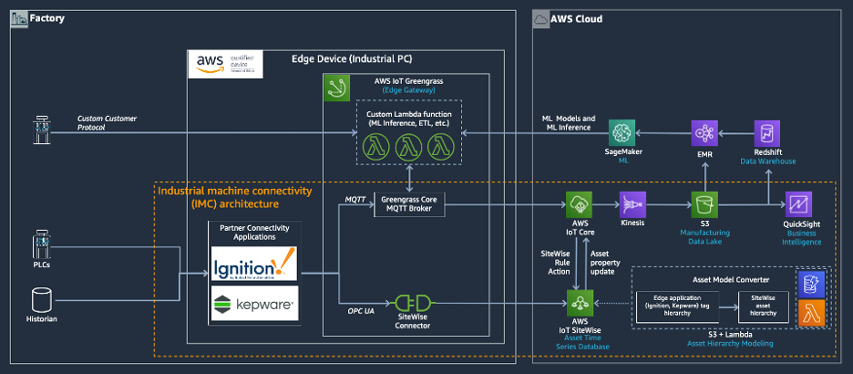

// Replace the content in <>
// Briefly describe the software. Use consistent and clear branding. 
// Include the benefits of using the software on AWS, and provide details on usage scenarios.

The IMC framework is designed to enable customers and partners to get data from their assets to AWS in a simple, structured process so they can rapidly realize the business value that is derived from that data. The IMC Quick Start has the capability to convert customers’ existing asset hierarchy definitions (i.e. factory, lines, machines, tags, etc.) defined in partner edge applications like Inductive Automation’s Ignition Server or PTC’s KEPServerEX to the equivalent asset hierarchy within AWS IoT SiteWise. This capability is enabled by the Asset Model Converter (AMC), a component of the IMC architecture. With asset hierarchies defined within IoT SiteWise, customer data can be ingested continuously to the AWS cloud and all the pertinent metadata is readily accessible for applications that will use that data to deliver business value, such as asset condition monitoring dashboards. 

With multiple ingestion patterns from edge to the cloud, customers and partners may choose the IMC Framework path that suits the needs of their specific use case. The first path is via the IoT SiteWise Connector running in an AWS IoT Greengrass core (via OPC-UA) to IoT SiteWise in the cloud. The second path is sending data directly from edge applications (i.e. Ignition Server with Cirrus Link MQTT Transmission module) to AWS IoT Core via MQTT. The third path is sending data from the edge application (i.e. Ignition Server or KEPServerEX) to IoT Greengrass where it can then be processed/filtered by customer-defined lambda functions, used for local machine learning model inference or consumed by a containerized Docker application processing. Raw and processed data can then be transmitted to the AWS cloud through a number of different paths including IoT Core, Kinesis Data Streams, or AWS IoT Analytics. These edge processing capabilities are not part of the IMC kit and partners/customers can add those components as needed.

The IMC kit includes the software and a list of hardware required to connect a customer's assets to the cloud and visualize their data. The primary objective of the framework is to enable partners to deliver a fast, inexpensive proof of value so that the customer can see real business value from the IIoT solution and will want to develop and deploy a complete production solution that addresses all of their critical use cases. One example of a proof of value deployment a partner could deliver would be helping enable a customer to visualize near real-time operational metrics and perform Root Cause Analysis (RCA) of their assets when a line goes down. There are two deployment modes of the framework: virtual (for evaluation and training) and physical (for real customer deployments). The CloudFormation templates provision the  cloud resources and generate the scripts required to bootstrap physical edge devices.

.IMC Framework
[link=images/imc_framework.png]
image::../images/imc_framework.png[IMC Framework,width=648,height=439]

The Industrial Machine Connectivity (IMC) kit enables connecting industrial assets into AWS cloud services along with visualizing data using AWS IoT SiteWise Monitor and QuickSight dashboards. This kit integrates with AWS IoT Partner edge software such as Inductive Automation’s Ignition Server and PTC’s KEPServerEX. These partner edge software applications handle the industrial protocol translation from the PLCs, other devices, historians and SCADA systems they connect to. The IMC architecture integrates both the data collected by the edge software applications and the asset model hierarchy that they maintain. The IMC architecture is shown below:

.IMC Reference Architecture
[link=images/imc_reference_architecture.png]

A key component of this kit is the Asset Model Converter (AMC). The AMC is a serverless, module-based framework supporting mapping edge-based asset modeling software conventions into AWS IoT SiteWise models and assets. 

Currently as part of this kit, there are following modules (drivers) available:

* Inductive Automation (Ignition Server)
** Cirrus Link Module MQTT driver
** Ignition Project File Export driver 
* PTC (KEPServerEX)
** KEPServerEX Project File Export driver 

Based on the driver selected, the AMC will ingest the edge software’s (i.e. Ignition or KEPServerEX) native asset model definition(s) and automatically provision the matching asset hierarchy within AWS IoT SiteWise. This automatic mapping enables application builders, whether they be customer’s own developers, SIs, GSIs or AWS ProServe team, to have immediate access to the customer’s asset hierarchy within a managed service in the AWS Cloud (AWS IoT SiteWise).

