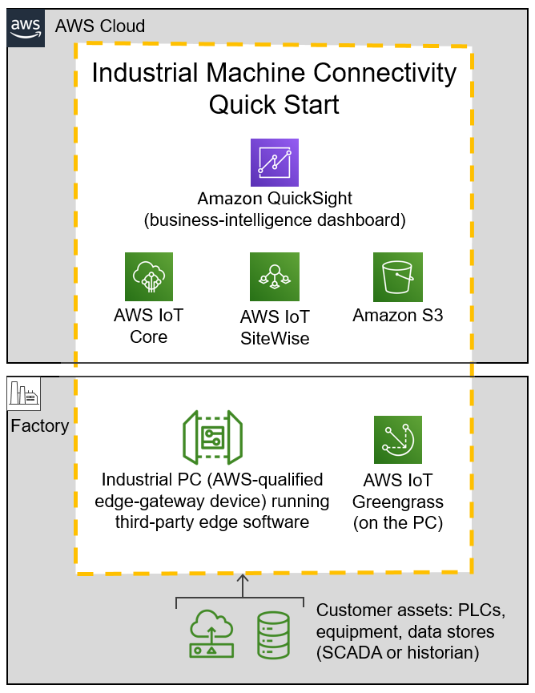

// Replace the content in <>
// Briefly describe the software. Use consistent and clear branding. 
// Include the benefits of using the software on AWS, and provide details on usage scenarios.

:xrefstyle: short

The primary objective of the {partner-product-short-name} Quick Start is to help AWS Partners deliver a proof of concept that addresses a use case of high value to the customer. For example, the customer might want to start by visualizing near-real-time operational metrics and analyzing root causes when a line goes down. After a successful proof of concept, the partner and customer may work together to build out the production architecture to address other critical use cases. 

The {partner-product-short-name} architecture includes AWS managed IoT edge services and AWS-qualified edge hardware. You can use a range of programmable logic controllers (PLCs). And you can publish data over various protocols: HTTPS, MQTT (Message Queuing Telemetry Transport), and OPC Unified Architecture (UA). With this Quick Start, you can automate production rollout of a connected-factory architecture across multiple sites. You can organize, store, and manage your IIoT data in various ways:

* Create or transfer virtual assets. 
* Create or transfer asset hierarchies. 
* Create a time-series hot-data store. 
* Transfer data from a historian or a SCADA (supervisory control and data acquisition) system. 
* Archive cold data in Amazon Simple Storage Service (Amazon S3). 

When you launch the {partner-product-short-name} Quick Start, an AWS CloudFormation template automates the deployment of resources into your AWS account. You deploy this Quick Start in either virtual mode (for evaluation and training) or physical mode (for customer deployments). The mode you choose depends on whether your edge hardware is virtual or physical. The architecture for virtual edge hardware includes an Amazon Elastic Compute Cloud (Amazon EC2) instance. The architecture for physical edge hardware includes an industrial PC on the customer premises. The mode determines the way you configure connectivity and security. All other cloud-based resources are largely the same for virtual and physical deployments.

[#IMC-QS-overview]
.{partner-product-short-name} Quick Start conceptual diagram

<<IMC-QS-overview>> shows a high-level view of a physical deployment. The dotted orange box outlines the {partner-product-short-name} Quick Start's main components.

* In the factory: 
** AWS IoT Greengrass runs on an industrial PC (an AWS-qualified edge-gateway device). AWS IoT Greengrass ingests data from a partner edge application, such as Inductive Automation's https://inductiveautomation.com/ignition/[Ignition^] or PTC's https://www.kepware.com/en-us/products/kepserverex/[KEPServerEX^]. 
** The partner edge application translates the data from the customer assets—including PLCs, equipment, and data stores (SCADA or historian)—into industrial protocols.  
* In the AWS Cloud:
** AWS IoT SiteWise stores the metadata for the asset-model hierarchy of the industrial assets on the factory floor. It also contains a managed database for the time-series data generated by these assets.
*** After the hierarchy is defined in AWS IoT SiteWise, the partner edge application continuously ingests the asset data and transmits it to the AWS Cloud through a SiteWise connector within AWS IoT Greengrass.
*** AWS IoT SiteWise serves as the hot-storage tier for both time-series data and metadata. All this data, including the metadata, is accessible to applications that can generate business value from it.
*** The AWS IoT SiteWise Monitor feature enables you to build dashboards to visualize near-real-time time-series data stored in AWS IoT SiteWise’s time-series database.
** AWS IoT Core receives and routes MQTT messages either directly from the partner edge application or from the AWS IoT Greengrass core.
** Amazon S3 can serve as a cold-storage tier for data.
** Amazon QuickSight lets you build custom business-intelligence dashboards and visualizations for data stored in the S3 bucket.
